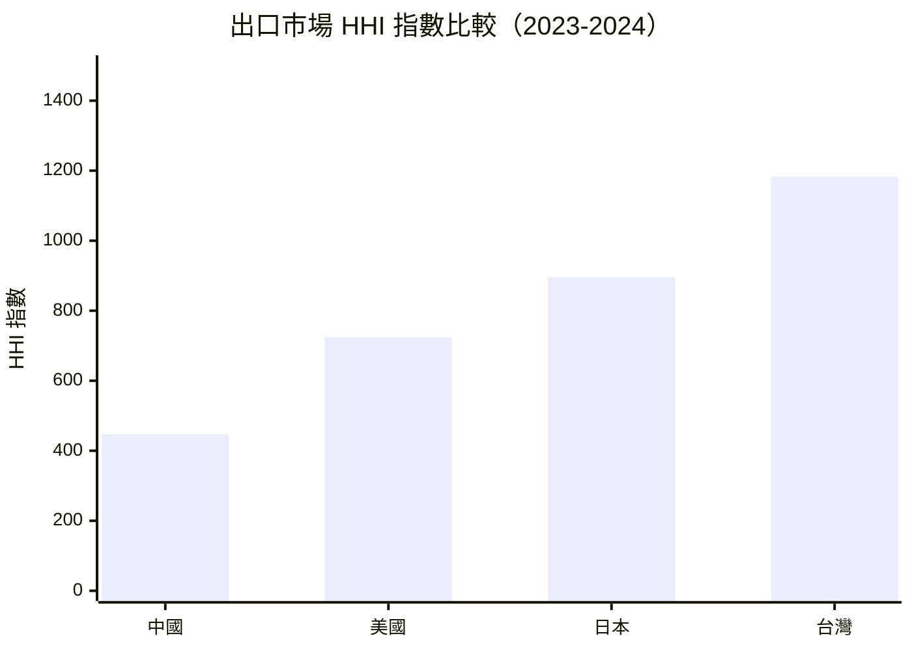
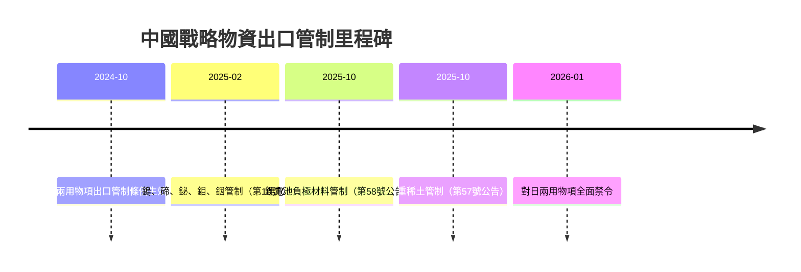

# 財經媒體簡報 — 2026 年第 08 週

> 報告期間：2026-02-17 — 2026-02-23
> 產出時間：2026-02-19
> 自動化程度：80%（數據彙整自動生成，新聞角度建議人工審核）

## 本週頭條數據

{: .highlight }
> 以下數據可直接引用，每項皆附來源標註。

### 1. 中國強化對日兩用物項出口管制

**一句話摘要**：
> 中國商務部於 2026 年 1 月 6 日宣布，禁止所有兩用物項出口至日本軍事用戶及任何有助於提升日本軍事實力的最終用途，為中國首次針對單一國家實施全面兩用物項禁令。

**核心數據**：
- 管制範圍：所有兩用物項（來源：cn_export_control/enforcement_action）
- 生效日期：2026-01-06，即時生效（來源：cn_export_control/regulation_update）
- 法律依據：《出口管制法》及《兩用物項出口管制條例》（來源：cn_export_control/regulation_update）

**可用角度**：
1. **地緣政治角度** — 中國將出口管制作為外交政策工具，回應日本涉台言論，標誌出口管制「武器化」新階段
2. **供應鏈角度** — 日本半導體、精密儀器、航空航天等產業面臨原材料供應中斷風險，可聚焦特定產業衝擊
3. **企業合規角度** — 第三方轉移禁令擴大管轄範圍，全球企業需重新評估涉及中國原產兩用物項的供應鏈風險

**歷史對比**：
- 首次針對單一國家實施全面兩用物項禁令（此前管制措施多針對特定企業或產品類別）
- 2024-2025 年間，中國陸續實施稀土、鋰電池、關鍵礦物出口管制，本次為管制範圍最廣的單次措施

---

### 2. 美中貿易逆差 2025 年顯著收窄

**一句話摘要**：
> 2025 年 11 月美國對中國貿易逆差為 139.4 億美元，較 2024 年同期的 251.7 億美元收窄 44.6%，為近年單月最大跌幅之一。

**核心數據**：
- 2025 年 11 月：逆差 139.4 億美元（來源：us_trade_census/trade_balance）
- 2024 年 11 月：逆差 251.7 億美元（來源：us_trade_census/trade_balance）
- 年減幅度：44.6%（來源：計算值）
- 2025 年美國對中出口：70.1 億美元（來源：us_trade_census/trade_balance）
- 2025 年美國自中進口：209.5 億美元（來源：us_trade_census/trade_balance）

**可用角度**：
1. **貿易戰效果角度** — 關稅措施與供應鏈重組是否正在改變美中貿易結構？逆差收窄是政策成效還是週期性波動？
2. **中國出口壓力角度** — 中國對美出口下滑反映內需疲弱與外需轉移雙重壓力
3. **供應鏈轉移角度** — 逆差收窄可能反映企業將生產基地轉移至越南、墨西哥等地的趨勢

**歷史對比**：
- 2024 年 1 月美中逆差高達 237.1 億美元，2025 年 1 月飆升至 317.4 億美元（疫情前囤貨效應），隨後逐月回落
- 2023 年 9 月逆差 284.7 億美元，顯示 2025 年全年趨勢為收窄

---

### 3. 台灣出口市場集中度維持低檔

**一句話摘要**：
> 台灣出口市場 HHI 指數為 1183.15，屬「低集中度」區間，前三大出口夥伴（中國、美國、香港）合計佔比 54.08%，顯示出口市場分散化程度優於多數亞洲經濟體。

**核心數據**：
- HHI 指數：1183.15（低集中度，< 1500）（來源：bilateral_trade_flows/market_concentration）
- 前三大出口夥伴佔比：54.08%（來源：bilateral_trade_flows/market_concentration）
- 第一大出口市場：中國，1926 億美元（來源：bilateral_trade_flows/export_flow）
- 第二大出口市場：美國，1878 億美元（來源：bilateral_trade_flows/export_flow）
- 貿易夥伴數：221 個（來源：bilateral_trade_flows/market_concentration）

**可用角度**：
1. **地緣風險角度** — 台灣對中、對美出口金額相近，在中美競爭中保持相對平衡，但兩岸緊張升級仍為主要風險
2. **半導體依賴角度** — 高科技產品（HS 85-類別）佔出口比重高，市場分散但產品集中
3. **東南亞轉移角度** — 新加坡、越南、馬來西亞躋身前十大出口市場，反映區域供應鏈重組

**歷史對比**：
- 中國 HHI 僅 447.18，為主要經濟體最分散；日本 894.65、美國 723.51 均屬低集中度
- 台灣對中出口順差 430 億美元，對美順差 1002 億美元，雙邊關係穩定但敏感

---

## 可引用圖表

### 圖表 1：主要經濟體出口市場集中度比較



> 圖表說明：HHI < 1500 為低集中度（分散化），1500-2500 為中度集中，> 2500 為高度集中（依賴）
> 數據來源：UN Comtrade (bilateral_trade_flows/market_concentration)

### 表格 1：美國對主要貿易夥伴月度逆差（2025 年 11 月）

| 貿易夥伴 | 出口（億美元） | 進口（億美元） | 逆差（億美元） | 年變化 |
|---------|--------------|--------------|--------------|--------|
| 中國 | 70.1 | 209.5 | -139.4 | -44.6% |
| 德國 | 68.2 | 134.9 | -66.7 | +2.9% |
| 韓國 | 54.4 | 87.3 | -32.8 | -34.3% |

> 數據來源：US Census Bureau (us_trade_census/trade_balance)

### 圖表 2：中國出口管制時序



> 圖表說明：中國出口管制政策逐步擴大，從特定物項延伸至針對特定國家的全面禁令
> 數據來源：cn_export_control

## 本週政策速覽

{: .warning }
> 基於 cn_export_control Layer，最多 5 條

| 政策 | 日期 | 一句話摘要 | 新聞價值 |
|------|------|-----------|---------|
| 對日兩用物項出口管制 | 2026-01-06 | 禁止所有兩用物項出口至日本軍事用戶及有助其軍事實力的用途 | 高 |
| 安世半導體事件回應 | 2025-11-20 | 商務部批評荷蘭政府托管安世股份，稱其損害全球半導體供應鏈穩定 | 高 |
| 重稀土出口管制 | 2025-10-13 | 對鈥、鉺、銩、銪、鐿五類重稀土實施出口管制，11月8日生效 | 高 |
| 鋰電池負極材料管制 | 2025-10-13 | 高密度鋰電池（≥300 Wh/kg）及石墨負極材料納入管制 | 高 |
| 關鍵礦物管制 | 2025-02-04 | 鎢、碲、鉍、鉬、銦五類戰略礦物即時實施出口管制 | 中 |

## 下週觀察

{: .note }
> 以下為推測性內容，非確定事實

1. **中荷半導體談判進展** — 荷蘭方面已同意派員來華磋商安世半導體事件，預計本週或下週可能有談判進展消息。若達成協議，可能緩解全球半導體供應鏈緊張。

2. **日本應對措施** — 日本政府可能於近期宣布因應中國兩用物項禁令的措施，包括替代供應來源規劃或反制措施。關注日本經產省動態。

3. **2 月美國貿易數據** — 美國 Census Bureau 通常於月中公布上月貿易數據，可觀察美中逆差收窄趨勢是否持續。

4. **中國兩會前瞻** — 全國兩會將於 3 月召開，可能預告產業政策與貿易政策方向，本週可能有相關風聲釋出。

## 引用指南

### 建議引用格式

```
根據全球貿易情報分析系統數據，{數據內容}。
（資料來源：{原始來源}，經全球貿易情報分析系統整理）
```

**範例**：

> 根據全球貿易情報分析系統數據，2025 年 11 月美國對中國貿易逆差為 139.4 億美元，較去年同期收窄 44.6%。
> （資料來源：US Census Bureau，經全球貿易情報分析系統整理）

### 原始資料來源

| 數據類型 | 原始來源 | 連結 |
|---------|---------|------|
| 雙邊貿易 | UN Comtrade | https://comtradeplus.un.org/ |
| 美國貿易 | US Census Bureau | https://www.census.gov/foreign-trade/ |
| 宏觀指標 | World Bank | https://data.worldbank.org/ |
| 出口管制 | 中國商務部 | http://exportcontrol.mofcom.gov.cn/ |

---

## 免責聲明

本報告由自動化系統產出，數據來自多個公開資料源。

**重要聲明**：
- 本報告供新聞參考使用，引用時請標註資料來源
- 數據可能因來源更新而發生回溯修正
- 新聞角度建議為系統生成，僅供參考
- 政策解讀為系統推測，建議另行查證
- 本系統不對引用本報告造成的任何後果負責

## 資料來源

- UN Comtrade Database (https://comtradeplus.un.org/)
- U.S. Census Bureau Foreign Trade (https://www.census.gov/foreign-trade/)
- World Bank Open Data (https://data.worldbank.org/)
- 中國商務部出口管制資訊網 (http://exportcontrol.mofcom.gov.cn/)
