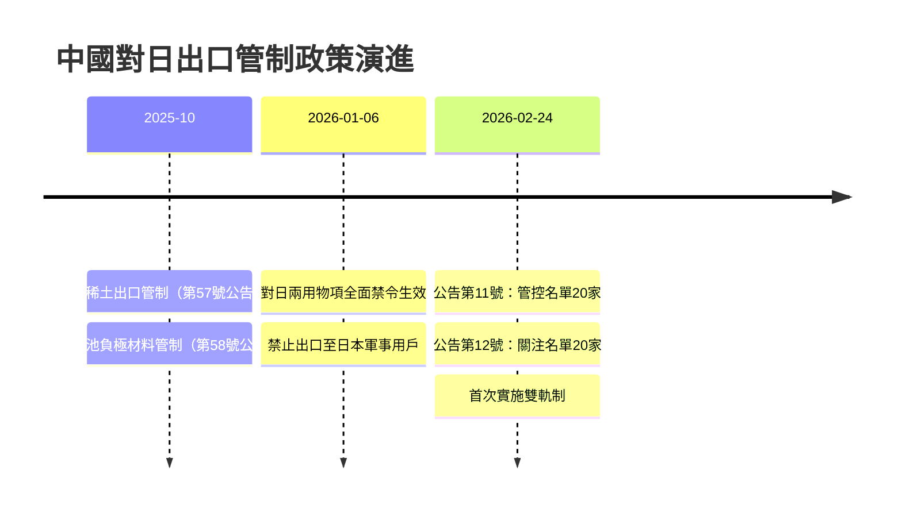
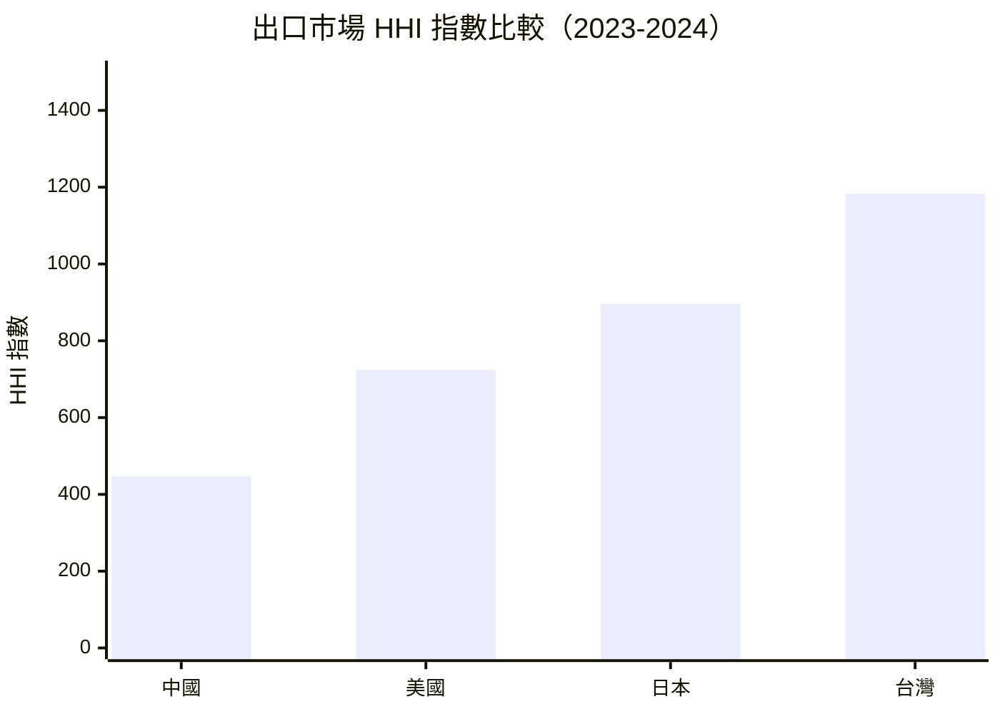

# 財經媒體簡報 — 2026 年第 09 週

> 報告期間：2026-02-24 — 2026-02-28
> 產出時間：2026-03-01
> 自動化程度：80%（數據彙整自動生成，新聞角度建議人工審核）

## 本週頭條數據
{: .article-summary .speakable-content}

{: .highlight }
> 以下數據可直接引用，每項皆附來源標註。

### 1. 中國對 40 家日本實體實施出口管制雙軌制
{: .key-answer data-question="中國對日本實施了什麼新的出口管制措施？"}

<div class="key-takeaway" markdown="1">
**一句話摘要**：
> 中國商務部 <span class="data-highlight">2026 年 2 月 24 日</span>同步發布公告第 11 號和第 12 號，將 <span class="data-highlight">40 家日本實體</span>分別列入管控名單（<span class="data-highlight">20 家</span>，完全禁止兩用物項出口）和關注名單（<span class="data-highlight">20 家</span>，強化許可審查），為近年最大規模的對日出口管制行動。
</div>

**核心數據**：
- 管控名單：<span class="data-highlight">20 家</span>日本國防航太實體（來源：cn_export_control/mofcom-announcement-2026-no11-japan-entity-list-2026-02-24.md）
- 關注名單：<span class="data-highlight">20 家</span>日本實體（來源：cn_export_control/mofcom-announcement-2026-no12-japan-watchlist-2026-02-24.md）
- 生效日期：2026-02-24，即時生效（來源：cn_export_control/mofcom-spokesperson-japan-export-controls-2026-02-24.md）
- 法律依據：《中華人民共和國出口管制法》及《兩用物項出口管制條例》

**被列入管控名單的主要實體**：
- 三菱重工集團：三菱造船、三菱重工航空發動機、三菱重工海洋機械、三菱重工發動機與渦輪增壓器、三菱重工海事系統（共 5 家）
- IHI 集團：IHI 原動機、IHI 主要金屬、IHI 噴射機服務、IHI 宇航、IHI 航空製造、IHI 宇航工程（共 6 家）
- 川崎重工：川崎重工航空宇宙系統、川重岐阜工程（共 2 家）
- NEC 集團：NEC 網路傳感器、NEC 航空宇宙系統（共 2 家）
- 其他：富士通防衛與國家安全、日本海洋聯合、JMU 防務系統、防衛大學、JAXA

**被列入關注名單的主要實體**：
- SUBARU、TDK、住友重機械工業、日東電工、三菱材料
- ENEOS（能源）、日野汽車
- 伊藤忠航空、三井物產航空航天（貿易商）
- 東京科學大學（學術機構）

**可用角度**（建議人工審核）：
1. **政策升級角度** — 從 1 月 6 日的泛用禁令升級為具體實體清單，顯示中國出口管制執法從「原則性禁止」進入「點名制裁」階段
2. **產業衝擊角度** — 被列入企業涵蓋國防航太、汽車、電子元件、重工業、學術研究，日本國防產業鏈面臨中國原材料斷供風險
3. **中日關係角度** — 官方稱措施旨在「制止日本再軍事化和擁核企圖」，措辭強硬，反映地緣政治緊張加劇
4. **雙軌制創新角度** — 首次同時使用管控名單（完全禁止）和關注名單（強化審查）的兩級制度，為中國出口管制工具箱新增彈性

**歷史對比**：
- 2026-01-06：中國宣布禁止所有兩用物項出口至日本軍事用戶（泛用禁令）
- 2026-02-24：升級為具體實體清單，40 家企業點名制裁（本週）
- 升級幅度：從原則性禁止 → 具體執法清單，間隔僅 49 天

---

### 2. 中日貿易互依與管制矛盾
{: .key-answer data-question="中日雙邊貿易關係如何？"}

<div class="key-takeaway" markdown="1">
**一句話摘要**：
> 日本是中國第 <span class="data-highlight">3</span> 大出口目的地（<span class="data-highlight">3,095 億美元</span>），中國是日本第 <span class="data-highlight">2</span> 大出口目的地（<span class="data-highlight">2,511 億美元</span>），雙邊貿易高度互依，但出口管制措施持續升級形成結構性矛盾。
</div>

**核心數據**：
- 中國對日出口：<span class="data-highlight">3,095 億美元</span>（2023-2024 累計）（來源：bilateral_trade_flows/export_flow/156-export-2024.md）
- 日本對中出口：<span class="data-highlight">2,511 億美元</span>（2023-2024 累計）（來源：bilateral_trade_flows/export_flow/392-export-2024.md）
- 日本出口 HHI：<span class="data-highlight">894.65</span>（低集中度）（來源：bilateral_trade_flows/market_concentration/392-hhi-2024.md）
- 日本前三大出口市場佔比：<span class="data-highlight">44.26%</span>（美國、中國、韓國）
- 日本貿易夥伴數：<span class="data-highlight">218 個</span>

**可用角度**（建議人工審核）：
1. **互依陷阱角度** — 中日互為重要貿易夥伴，但出口管制升級顯示經濟互依無法阻止地緣政治對抗
2. **日本應變角度** — 日本出口市場 HHI 894.65 屬低集中度，但對中出口仍佔第 2 位，替代市場開拓壓力增加
3. **產業鏈韌性角度** — 被列入清單的企業多為日本國防航太核心供應商，中國原材料佔比需進一步調查

**歷史對比**：
- 中國連續多年為日本第 1 或第 2 大出口市場
- 日本對中出口 2,511 億美元，對美出口 2,867 億美元，差距約 14%
- 出口管制若持續升級，可能加速日本供應鏈「去中國化」

---

### 3. 日本出口市場集中度分析
{: .key-answer data-question="日本出口市場的風險分散程度如何？"}

<div class="key-takeaway" markdown="1">
**一句話摘要**：
> 日本出口市場 HHI 指數為 <span class="data-highlight">894.65</span>，屬「低集中度」區間（< 1500），但對美中兩大市場出口合計佔 <span class="data-highlight">37.72%</span>，面臨雙邊管制風險。
</div>

**核心數據**：
- HHI 指數：<span class="data-highlight">894.65</span>（低集中度，< 1500）（來源：bilateral_trade_flows/market_concentration/392-hhi-2024.md）
- 前三大出口夥伴佔比：<span class="data-highlight">44.26%</span>（來源：bilateral_trade_flows/market_concentration/392-hhi-2024.md）
- 對美出口：<span class="data-highlight">2,867 億美元</span>（第 1 位）
- 對中出口：<span class="data-highlight">2,511 億美元</span>（第 2 位）
- 貿易夥伴數：<span class="data-highlight">218 個</span>

**可用角度**（建議人工審核）：
1. **雙向風險角度** — 日本同時面臨美國（關稅威脅）與中國（出口管制）雙向貿易風險，夾在兩大國之間
2. **分散化進展角度** — HHI 低於 1000 顯示日本已具備一定市場分散度，但高科技產品仍高度依賴美中市場
3. **CPTPP 機遇角度** — 日本可透過 CPTPP 框架深化與東南亞、大洋洲貿易，降低美中依賴

---

## 可引用圖表
{: .key-answer data-question="有哪些圖表可供媒體引用？"}

### 表格 1：被列入管控名單的 20 家日本實體（完全禁止出口）

| 編號 | 實體名稱（中文） | 實體名稱（英文） | 產業領域 |
|-----|----------------|-----------------|---------|
| 1 | 三菱造船 | Mitsubishi Heavy Industries Shipbuilding | 造船 |
| 2 | 三菱重工航空發動機 | Mitsubishi Heavy Industries Aero Engines | 航空 |
| 3 | 三菱重工海洋機械 | Mitsubishi Heavy Industries Marine Machinery | 造船 |
| 4 | 三菱重工發動機與渦輪增壓器 | Mitsubishi Heavy Industries Engine & Turbocharger | 發動機 |
| 5 | 三菱重工海事系統 | Mitsubishi Heavy Industries Maritime Systems | 造船 |
| 6 | 川崎重工航空宇宙系統 | Kawasaki Heavy Industries Aerospace Systems | 航空航天 |
| 7 | 川重岐阜工程 | KAWAJU Gifu Engineering | 工程 |
| 8 | 富士通防衛與國家安全 | Fujitsu Defense & National Security | 電子 |
| 9 | IHI 原動機 | IHI Power Systems | 發動機 |
| 10 | IHI 主要金屬 | IHI Master Metal | 材料 |
| 11 | IHI 噴射機服務 | IHI Jet Service | 航空 |
| 12 | IHI 宇航 | IHI Aerospace | 航天 |
| 13 | IHI 航空製造 | IHI Aero Manufacturing | 航空 |
| 14 | IHI 宇航工程 | IHI Aerospace Engineering | 航天 |
| 15 | NEC 網路傳感器 | NEC Network and Sensor Systems | 電子 |
| 16 | NEC 航空宇宙系統 | NEC Aerospace Systems | 航空航天 |
| 17 | 日本海洋聯合 | Japan Marine United Corporation | 造船 |
| 18 | JMU 防務系統 | JMU Defense Systems | 國防 |
| 19 | 防衛大學 | National Defense Academy of Japan | 學術 |
| 20 | 日本宇宙航空研究開發機構 | JAXA | 航天 |
{: .comparison-table}

> 數據來源：中國商務部公告 2026 年第 11 號（cn_export_control/mofcom-announcement-2026-no11-japan-entity-list-2026-02-24.md）

### 表格 2：被列入關注名單的 20 家日本實體（強化許可審查）

| 編號 | 實體名稱（中文） | 實體名稱（英文） | 產業領域 |
|-----|----------------|-----------------|---------|
| 1 | 斯巴魯 | SUBARU Corporation | 汽車/航空 |
| 2 | 富士航空航天技術 | FUJI Aerospace Technology | 航空航天 |
| 3 | 引能仕（ENEOS） | ENEOS Corporation | 能源 |
| 4 | 運輸機工業 | Yusoki Co. | 機械 |
| 5 | 伊藤忠航空 | ITOCHU Aviation | 貿易 |
| 6 | 儷達集團控股 | Leda Group Holdings | 控股 |
| 7 | 東京科學大學 | Institute of Science Tokyo | 學術 |
| 8 | 三菱材料 | Mitsubishi Materials Corporation | 材料 |
| 9 | ASPP | ASPP Co. | 航空 |
| 10 | 八洲電機 | Yashima Denki | 電機 |
| 11 | 住友重機械工業 | Sumitomo Heavy Industries | 重工業 |
| 12 | TDK | TDK Corporation | 電子元件 |
| 13 | 三井物產航空航天 | Mitsui Bussan Aerospace | 貿易 |
| 14 | 日野汽車 | Hino Motors | 汽車 |
| 15 | 東金 | Tokin Corporation | 電子 |
| 16 | 日新電機 | Nissin Electric | 電機 |
| 17 | 三泰克托 | Sun Tectro | 技術 |
| 18 | 日東電工 | Nitto Denko Corporation | 材料 |
| 19 | 日油 | NOF Corporation | 化學 |
| 20 | 半井試劑 | Nacalai Tesque | 化學 |
{: .comparison-table}

> 數據來源：中國商務部公告 2026 年第 12 號（cn_export_control/mofcom-announcement-2026-no12-japan-watchlist-2026-02-24.md）

### 圖表 1：中國對日出口管制升級時序



> 圖表說明：中國對日出口管制從原則性禁令升級為具體實體清單，間隔僅 49 天
> 數據來源：cn_export_control

### 圖表 2：主要經濟體出口市場集中度比較



> 圖表說明：HHI < 1500 為低集中度（分散化），1500-2500 為中度集中，> 2500 為高度集中（依賴）
> 數據來源：UN Comtrade (bilateral_trade_flows/market_concentration)

## 本週政策速覽
{: .key-answer data-question="本週有哪些重要政策值得關注？"}

{: .warning }
> 基於 cn_export_control Layer，最多 5 條

| 政策 | 日期 | 一句話摘要 | 新聞價值 |
|------|------|-----------|---------|
| 公告第 11 號（日本管控名單） | <span class="data-highlight">2026-02-24</span> | 20 家日本國防航太實體完全禁止兩用物項出口 | <span class="data-highlight">高</span> |
| 公告第 12 號（日本關注名單） | <span class="data-highlight">2026-02-24</span> | 20 家日本實體須強化許可審查，含風險評估與書面承諾 | <span class="data-highlight">高</span> |
| 發言人答記者問（雙軌制說明） | <span class="data-highlight">2026-02-24</span> | 解釋管控/關注名單差異、合規要求及移除機制 | 中 |
| 對日兩用物項全面禁令（持續追蹤） | <span class="data-highlight">2026-01-06</span> | 禁止所有兩用物項出口至日本軍事用戶及相關用途 | 中 |
{: .comparison-table}

## 下週觀察
{: .key-answer data-question="下週有哪些值得觀察的事件？"}

{: .note }
> 以下為推測性內容，非確定事實

1. **日本政府反應** — 預計日本經濟產業省、外務省將於本週或下週發布正式聲明回應中國制裁。關注日本是否採取反制措施或尋求外交協商。

2. **被制裁企業應對** — 三菱重工、IHI、川崎重工等被列入管控名單的企業可能發布投資人聲明，說明中國原材料依賴程度與替代方案。

3. **中國兩會政策風向** — 全國兩會即將於 3 月召開，可能預告更廣泛的產業政策與出口管制方向。

4. **美日安保磋商** — 美日可能就中國出口管制進行安保層級協商，評估對日本國防產業的影響及因應方案。

5. **供應鏈調整動態** — 關注日本企業是否加速從中國以外地區採購戰略原材料，以及相關供應商股價變動。

## 引用指南
{: .key-answer data-question="如何正確引用本報告的數據？"}

### 建議引用格式

```
根據全球貿易情報分析系統數據，{數據內容}。
（資料來源：{原始來源}，經全球貿易情報分析系統整理）
```

**範例**：

> 根據全球貿易情報分析系統數據，中國商務部於 2026 年 2 月 24 日將 40 家日本實體列入出口管制清單，其中 20 家列入管控名單（完全禁止出口）、20 家列入關注名單（強化審查）。
> （資料來源：中國商務部，經全球貿易情報分析系統整理）

### 原始資料來源

| 數據類型 | 原始來源 | 連結 |
|---------|---------|------|
| 雙邊貿易 | UN Comtrade | https://comtradeplus.un.org/ |
| 美國貿易 | US Census Bureau | https://www.census.gov/foreign-trade/ |
| 宏觀指標 | World Bank | https://data.worldbank.org/ |
| 出口管制 | 中國商務部 | http://exportcontrol.mofcom.gov.cn/ |

---

## 免責聲明

本報告由自動化系統產出，數據來自多個公開資料源。

**重要聲明**：
- 本報告供新聞參考使用，引用時請標註資料來源
- 數據可能因來源更新而發生回溯修正
- 新聞角度建議為系統生成，僅供參考
- 政策解讀為系統推測，建議另行查證
- 本系統不對引用本報告造成的任何後果負責

## 資料來源

- UN Comtrade Database (https://comtradeplus.un.org/)
- U.S. Census Bureau Foreign Trade (https://www.census.gov/foreign-trade/)
- World Bank Open Data (https://data.worldbank.org/)
- 中國商務部出口管制資訊網 (http://exportcontrol.mofcom.gov.cn/)
