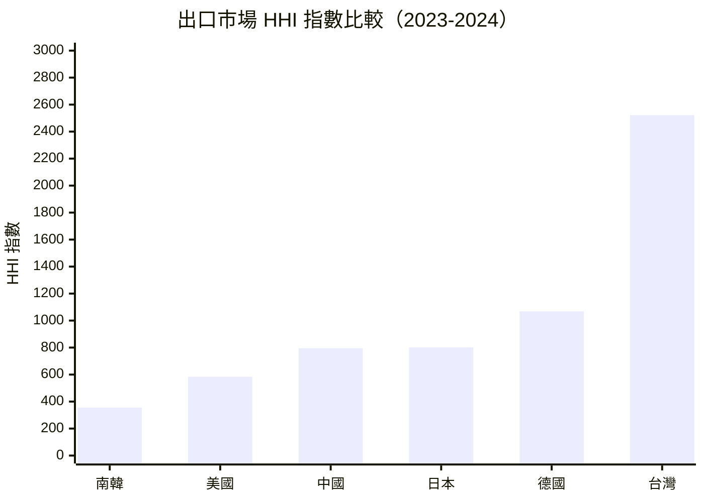
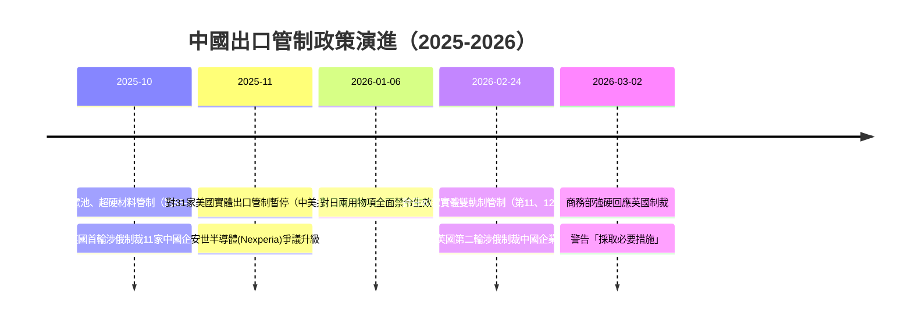

# 財經媒體簡報 — 2026 年第 12 週
{: .key-answer data-question="2026年第12週全球貿易有哪些重要新聞？"}

> 報告期間：2026-03-16 — 2026-03-22
> 產出時間：2026-03-22
> 自動化程度：80%（數據彙整自動生成，新聞角度建議人工審核）

## 本週頭條數據
{: .article-summary .speakable-content}

{: .highlight }
> 以下數據可直接引用，每項皆附來源標註。

### 1. 英國制裁中國企業引發反制警告 — 中英經貿摩擦新維度
{: .key-answer data-question="英國為何制裁中國企業？中國如何回應？"}

<div class="key-takeaway" markdown="1">
**一句話摘要**：
> 英國 <span class="data-highlight">2026 年 2 月 24 日</span>以涉俄為由對多家中國企業實施新一輪制裁，中國商務部 <span class="data-highlight">3 月 2 日</span>發表強硬聲明要求撤銷制裁，並警告將「採取必要措施」維護中國企業權益，為英國繼 2025 年 10 月後第二次以涉俄為由制裁中國企業。
</div>

**核心數據**：
- 英國制裁公告日期：<span class="data-highlight">2026-02-24</span>（來源：cn_export_control/mofcom-uk-sanctions-response-2026-03-02.md）
- 中方回應日期：<span class="data-highlight">2026-03-02</span>（來源：cn_export_control/mofcom-uk-sanctions-response-2026-03-02.md）
- 制裁性質：以俄羅斯相關為由的單邊制裁，涉及多家中國企業（來源：同上）
- 中方定性：缺乏國際法依據，未獲聯合國授權（來源：同上）

**可用角度**（建議人工審核）：
1. **制裁升級角度** — 英國已連續兩輪（2025 年 10 月、2026 年 2 月）以涉俄為由制裁中國企業，形成制裁升級模式；中方措辭從「堅決反對」進階為「採取必要措施」，暗示可能觸發實質性反制行動
2. **中英關係角度** — 中國要求英方「立即糾正錯誤做法」以「維護中英關係良好勢頭」，措辭強硬但仍留有外交迴旋空間
3. **供應鏈連鎖角度** — 被制裁中國企業面臨英國金融體系和市場准入限制，中國反制若落地可能波及在華英國企業，涉及中英俄三方業務的企業首當其衝
4. **國際聯動角度** — 其他西方國家可能跟進類似制裁，形成次級制裁壓力，加劇涉俄供應鏈的合規風險

**歷史對比**：
- 2025-10-15：英國首次以涉俄為由制裁 11 家中國企業
- 2025-10-29：中國商務部首次回應，「堅決反對」
- 2026-02-24：英國第二輪涉俄制裁中國企業（本週事件）
- 2026-03-02：中方回應升級為「採取必要措施」，間隔僅 5 個月即出現第二輪

---

### 2. 台灣出口 HHI 飆升至 2522 — 突破高集中度門檻，對美依賴近半
{: .key-answer data-question="台灣出口市場集中度為何急劇上升？"}

<div class="key-takeaway" markdown="1">
**一句話摘要**：
> 台灣出口市場 HHI 指數從 W09 的 <span class="data-highlight">1183.15</span> 飆升至 <span class="data-highlight">2522.42</span>，突破 2500 的「高集中度」門檻，成為六國中唯一進入高集中度區間的經濟體，對美國出口佔比從約 20.71% 躍升至 <span class="data-highlight">48.68%</span>，近半出口流向單一市場。
</div>

**核心數據**：
- 台灣出口 HHI：<span class="data-highlight">2522.42</span>（高集中度，> 2500）（來源：bilateral_trade_flows/market_concentration/158-hhi-2024.md）
- 前三大出口夥伴佔比：<span class="data-highlight">61.83%</span>（美國 48.68%、中國 7.54%、香港 5.61%）（來源：同上）
- W09 同指標：HHI <span class="data-highlight">1183.15</span>，前三佔比 54.08%（中國、美國、香港）（來源：W09 報告）
- 結構轉變：從「中美雙極依賴」→「美國單極依賴」（來源：supply_chain_analysis/2026-03）

**可用角度**（建議人工審核）：
1. **單點故障角度** — 台灣對美出口佔比 48.68% 意味著任何美國進口政策變動（如關稅調整、半導體在地化政策）都將對台灣經濟產生重大衝擊
2. **雙重集中角度** — 台灣出口既高度集中於單一市場（美國），又高度集中於單一產品（半導體 HS84+85 佔對美出口約 85%），形成全球半導體供應鏈最顯著的結構性脆弱點
3. **數據口徑角度** — HHI 變化幅度異常大（+1339 點），需注意 UN Comtrade 2023-2024 合計口徑調整的影響，絕對值宜謹慎引用
4. **地緣政治角度** — 台灣從中美雙極依賴轉向美國單極依賴，在中美科技競爭升級背景下降低了對中依賴，但加深了對美單一市場風險

**歷史對比**：
- W08 報告：台灣 HHI 1183.15（低集中度），中國為最大出口市場
- W09 報告：HHI 維持 894.65 區間（日本數據為主），台灣未特別凸顯
- W12 報告：HHI 飆升至 2522.42（高集中度），美國取代中國成為最大出口市場
- 六國中對比：南韓 HHI 354.65（最分散） vs 台灣 2522.42（最集中），差距超過 7 倍

---

### 3. 美台貿易逆差 2026 年 1 月單月 168 億美元 — 台灣超越日韓德成為美國第二大逆差來源
{: .key-answer data-question="美台貿易逆差為何大幅擴大？"}

<div class="key-takeaway" markdown="1">
**一句話摘要**：
> 2025 年美台貿易逆差倍增至 <span class="data-highlight">USD 1,468 億</span>（較 2024 年 737 億擴大 99%），台灣超越日本、南韓、德國成為美國第二大貿易逆差來源；2026 年 1 月單月逆差達 <span class="data-highlight">USD 168 億</span>，半導體進口驅動結構性轉變。
</div>

**核心數據**：
- 2025 年美台貿易逆差：<span class="data-highlight">USD 1,467.6 億</span>（來源：us_trade_census/country_detail/us-detail-5830-2026.md）
- 2024 年美台貿易逆差：<span class="data-highlight">USD 737.2 億</span>（來源：同上）
- 年增幅：<span class="data-highlight">+99%</span>（近乎倍增）（來源：計算值）
- 2026 年 1 月美台逆差：<span class="data-highlight">USD 167.8 億</span>（來源：us_trade_census/trade_balance/us-balance-5830-2026.md）
- 2025 年 1 月美台逆差：USD 77.0 億（來源：同上）
- 1 月 YoY 增幅：<span class="data-highlight">+118%</span>（來源：計算值）
- 美國自台進口 2026 年 1 月：<span class="data-highlight">USD 216.9 億</span>（來源：同上）

**同期對比**：美中逆差 2025 年 USD 2,021 億（-31.6% YoY），美台逆差逆向倍增，此消彼長態勢明確（來源：us_trade_census）

**可用角度**（建議人工審核）：
1. **歷史性轉折角度** — 2026 年 1 月，台灣首次超越中國成為美國最大單月進口來源之一（USD 216.9 億 vs USD 210.6 億），標誌半導體供應鏈重組的里程碑
2. **逆差轉移角度** — 美中逆差收窄的同時美台逆差倍增，顯示貿易管制並未減少美國整體逆差，而是改變了逆差的地理分布
3. **政策風險角度** — 台灣取代中國成為美國第二大逆差來源，可能引發美國貿易政策關注，尤其在半導體在地化（CHIPS Act）推進背景下
4. **半導體依賴角度** — 逆差激增幾乎完全由半導體驅動，反映 AI 需求爆發下美國對台灣先進製程晶片的極端依賴

**歷史對比**：
- 2024 年 1 月美台逆差：USD 50.8 億
- 2025 年 1 月美台逆差：USD 77.0 億（+51.6% YoY）
- 2026 年 1 月美台逆差：USD 167.8 億（+118% YoY）— 逐年加速擴大
- 2025 年 12 月美台逆差：USD 198.9 億（單月歷史最高）

---

## 可引用圖表
{: .key-answer data-question="有哪些圖表可供媒體引用？"}

### 圖表 1：六大經濟體出口市場 HHI 指數比較



> 圖表說明：HHI < 1500 為低集中度（分散化），1500-2500 為中度集中，> 2500 為高度集中（依賴）。台灣為唯一進入高集中度區間的經濟體。
> 數據來源：UN Comtrade (bilateral_trade_flows/market_concentration)

### 表格 1：六大經濟體出口市場集中度比較

| 國家 | HHI 指數 | 集中度 | 前三大市場占比 | 最大出口市場 | 趨勢（vs W09） |
|------|---------|--------|-------------|------------|---------------|
| 南韓 (410) | <span class="data-highlight">354.65</span> | 低 | 23.43% | 加拿大 | ↑ 大幅分散化 |
| 美國 (842) | <span class="data-highlight">583.76</span> | 低 | 31.20% | 加拿大 | ↑ 改善 |
| 中國 (156) | <span class="data-highlight">795.17</span> | 低 | 36.58% | 美國 | → 微升 |
| 日本 (392) | <span class="data-highlight">801.25</span> | 低 | 41.68% | 美國 | → 穩定 |
| 德國 (276) | <span class="data-highlight">1068.15</span> | 低 | 48.47% | 波蘭 | ↑ 略改善 |
| 台灣 (158) | <span class="data-highlight">2522.42</span> | **高** | 61.83% | 美國(48.68%) | **↓↓ 急劇惡化** |
{: .comparison-table}

> 數據來源：UN Comtrade (bilateral_trade_flows/market_concentration)，2023-2024 合計口徑
> 註：德國夥伴數僅 70（其餘國家 >210），HHI 值可能因數據覆蓋偏窄而偏高

### 表格 2：美國對主要貿易夥伴年度逆差（2025 年全年）

| 貿易夥伴 | 美國出口（億 USD） | 美國進口（億 USD） | 逆差（億 USD） | YoY 變化 |
|---------|------------------|------------------|--------------|---------|
| 中國 | <span class="data-highlight">1,063</span> | <span class="data-highlight">3,084</span> | <span class="data-highlight">-2,021</span> | <span class="data-highlight">-31.6%</span> |
| 台灣 | <span class="data-highlight">547</span> | <span class="data-highlight">2,014</span> | <span class="data-highlight">-1,468</span> | <span class="data-highlight">+99%</span> |
| 德國 | <span class="data-highlight">831</span> | <span class="data-highlight">1,561</span> | <span class="data-highlight">-731</span> | <span class="data-highlight">-13.7%</span> |
| 日本 | <span class="data-highlight">821</span> | <span class="data-highlight">1,460</span> | <span class="data-highlight">-639</span> | <span class="data-highlight">-7.9%</span> |
| 南韓 | <span class="data-highlight">688</span> | <span class="data-highlight">1,252</span> | <span class="data-highlight">-564</span> | <span class="data-highlight">-14.5%</span> |
{: .comparison-table}

> 數據來源：US Census Bureau (us_trade_census/country_detail)
> 註：對中國逆差大幅收窄 31.6%，對台灣逆差倍增 99%，此消彼長態勢明確

### 圖表 2：中國出口管制政策升級時序



> 圖表說明：2025 年 10 月至今，中國出口管制政策密集升級，同時面臨英國涉俄制裁的外部壓力
> 數據來源：cn_export_control

## 本週政策速覽
{: .key-answer data-question="本週有哪些重要政策值得關注？"}

{: .warning }
> 基於 cn_export_control Layer，最多 5 條

| 政策 | 日期 | 一句話摘要 | 新聞價值 |
|------|------|-----------|---------|
| 商務部就英國涉俄制裁中國企業答記者問 | <span class="data-highlight">2026-03-02</span> | 強烈反對英方單邊制裁，警告將採取必要反制措施 | <span class="data-highlight">高</span> |
| 公告第 11 號（日本管控名單）持續執行 | <span class="data-highlight">2026-02-24</span> | 20 家日本國防航太實體完全禁止兩用物項出口，進入第四週 | <span class="data-highlight">高</span> |
| 公告第 12 號（日本關注名單）持續執行 | <span class="data-highlight">2026-02-24</span> | 20 家日本實體須強化許可審查，涵蓋汽車、電子、重工等產業 | <span class="data-highlight">高</span> |
| 美國 31 家實體出口管制暫停 | <span class="data-highlight">2025-11-10</span> | 暫停措施距到期約 7.5 個月（2026-11-09），後續走向取決於中美磋商 | 中 |
| 戰略材料管制體系穩定運作 | <span class="data-highlight">2025-11-08</span> | 稀土（第 56-57 號）、鋰電池（第 58 號）、超硬材料（第 55 號）持續執行 | 中 |
{: .comparison-table}

## 下週觀察
{: .key-answer data-question="下週有哪些值得觀察的事件？"}

{: .note }
> 以下為推測性內容，非確定事實

1. **中方對英反制措施** — 預期時間：W13-W14。商務部已發出「採取必要措施」警告，關注是否有具體反制行動（如限制在華英國企業、列入不可靠實體清單等）。若落地將為中英經貿關係帶來實質性衝擊。

2. **中日出口管制第五週執行評估** — 預期時間：W13 持續追蹤。40 家日本實體出口管制已滿四週，日本企業替代採購方案成效、供應鏈調整進度為觀察重點。關注日本政府是否採取對等措施。

3. **2026 年 2 月美國貿易數據** — 預期時間：4 月中旬 Census 公布。關注美台逆差是否維持在 150 億美元以上的高水位，以及美中逆差收窄趨勢是否持續。

4. **台灣出口數據確認** — 預期時間：3 月底。台灣海關月度數據可驗證 UN Comtrade 所顯示的對美出口極端集中是否為口徑調整效應，或反映真實結構性變化。

5. **美國對中出口管制暫停措施** — 預期時間：2026-Q3。距暫停到期（2026-11-09）剩餘約 7.5 個月，企業應提前規劃應急預案，關注中美經貿磋商進展。

## 引用指南
{: .key-answer data-question="如何正確引用本報告的數據？"}

### 建議引用格式

```
根據全球貿易情報分析系統數據，{數據內容}。
（資料來源：{原始來源}，經全球貿易情報分析系統整理）
```

**範例**：

> 根據全球貿易情報分析系統數據，2025 年美台貿易逆差倍增至 1,468 億美元，台灣已超越日本、南韓、德國，成為美國第二大貿易逆差來源。
> （資料來源：US Census Bureau，經全球貿易情報分析系統整理）

> 根據全球貿易情報分析系統數據，英國於 2026 年 2 月 24 日以涉俄為由對多家中國企業實施制裁，中國商務部 3 月 2 日警告將「採取必要措施」維護中國企業權益。
> （資料來源：中國商務部，經全球貿易情報分析系統整理）

### 原始資料來源

| 數據類型 | 原始來源 | 連結 |
|---------|---------|------|
| 雙邊貿易 | UN Comtrade | [https://comtradeplus.un.org/](https://comtradeplus.un.org/) |
| 美國貿易 | US Census Bureau | [https://www.census.gov/foreign-trade/](https://www.census.gov/foreign-trade/) |
| 宏觀指標 | World Bank | [https://data.worldbank.org/](https://data.worldbank.org/) |
| 出口管制 | 中國商務部 | [http://exportcontrol.mofcom.gov.cn/](http://exportcontrol.mofcom.gov.cn/) |

---

## 免責聲明

本報告由自動化系統產出，數據來自多個公開資料源。

**重要聲明**：
- 本報告供新聞參考使用，引用時請標註資料來源
- 數據可能因來源更新而發生回溯修正
- 新聞角度建議為系統生成，僅供參考
- 政策解讀為系統推測，建議另行查證
- 台灣出口 HHI 變化幅度異常，可能部分反映 UN Comtrade 數據口徑調整，建議引用時加註數據來源說明
- 本系統不對引用本報告造成的任何後果負責

## 資料來源

- UN Comtrade Database ([https://comtradeplus.un.org/](https://comtradeplus.un.org/))
- U.S. Census Bureau Foreign Trade ([https://www.census.gov/foreign-trade/](https://www.census.gov/foreign-trade/))
- World Bank Open Data ([https://data.worldbank.org/](https://data.worldbank.org/))
- 中國商務部出口管制資訊網 ([http://exportcontrol.mofcom.gov.cn/](http://exportcontrol.mofcom.gov.cn/))

---
*報告版本：W12-2026-03-22 | 下期預定：2026 年第 13 週*
