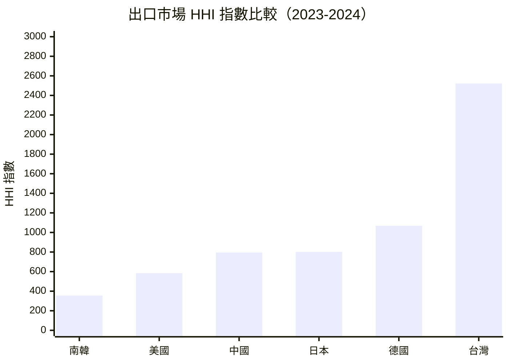
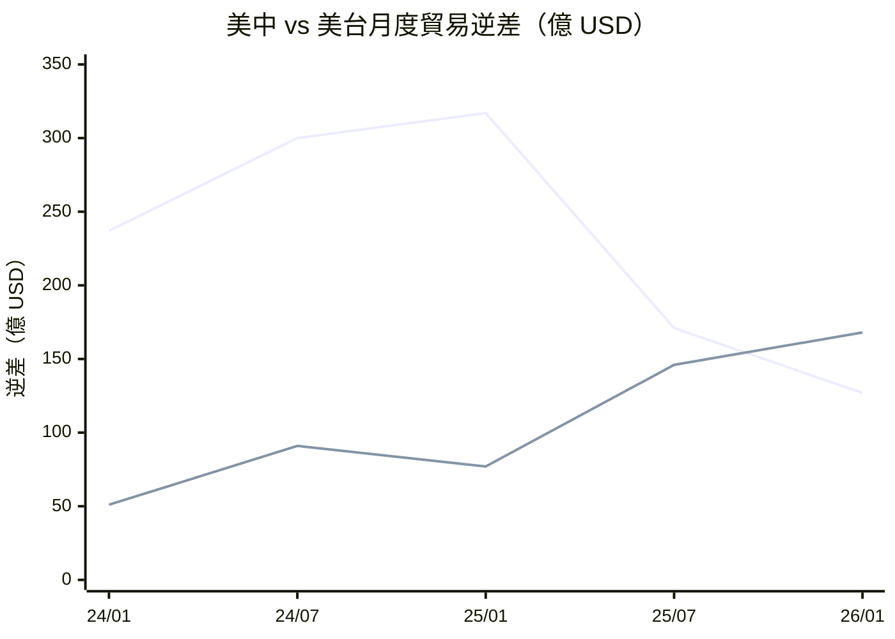

# 財經媒體簡報 — 2026 年第 13 週
{: .key-answer data-question="2026年第13週全球貿易有哪些重要新聞？"}

> 報告期間：2026-03-23 — 2026-03-29
> 產出時間：2026-03-23
> 自動化程度：80%（數據彙整自動生成，新聞角度建議人工審核）

## 本週頭條數據
{: .article-summary .speakable-content}

{: .highlight }
> 以下數據可直接引用，每項皆附來源標註。

### 1. 中日出口管制滿月：40 家實體無一移除，三層管制體系穩定運作
{: .key-answer data-question="中國對日本出口管制滿月後的執行情況如何？"}

<div class="key-takeaway" markdown="1">
**一句話摘要**：
> 中國對日本 <span class="data-highlight">40 家實體</span>出口管制自 <span class="data-highlight">2026 年 2 月 24 日</span>生效至今滿一個月，管控名單 <span class="data-highlight">20 家</span>國防航太實體持續被完全禁止兩用物項出口、關注名單 <span class="data-highlight">20 家</span>實體持續須強化許可審查，截至本週尚無任何名單移除或調整案例，顯示北京對日出口管制立場未見鬆動。
</div>

**核心數據**：
- 管控名單：<span class="data-highlight">20 家</span>日本國防航太實體，完全禁止出口（來源：cn_export_control/mofcom-announcement-2026-no11-japan-entity-list-2026-02-24.md）
- 關注名單：<span class="data-highlight">20 家</span>日本實體，須強化許可審查（來源：cn_export_control/mofcom-announcement-2026-no12-japan-watchlist-2026-02-24.md）
- 生效日期：<span class="data-highlight">2026-02-24</span>，即時生效（來源：cn_export_control/mofcom-spokesperson-japan-export-controls-2026-02-24.md）
- 執行天數：<span class="data-highlight">27 天</span>（截至 2026-03-23）
- 名單調整案例：<span class="data-highlight">0 件</span>

**管控名單主要實體**：三菱重工集團（5 家）、IHI 集團（6 家）、川崎重工（2 家）、NEC（2 家）、JAXA、防衛大學等

**關注名單主要實體**：SUBARU、TDK、住友重機械工業、日東電工、三菱材料、ENEOS 等

**可用角度**（建議人工審核）：
1. **滿月零調整角度** — 40 家實體無一移除顯示中國對日出口管制具有長期戰略意圖，非短期談判籌碼，日本企業應以「常態化管制」而非「暫時性措施」規劃應對
2. **三層管制升級角度** — 從 2026-01-06 泛用禁令到 2026-02-24 實體清單，49 天內完成「原則性禁止→點名制裁」的升級，管控密度超越中國對美、對歐的節奏
3. **防衛產業鏈角度** — 被列入管控名單的三菱重工、川崎重工、IHI 為日本防衛省主要承包商，中國原材料替代方案的建立需數月至數年，短期內影響生產排程
4. **中日關係基調角度** — 出口管制與中日雙邊貿易高度互依形成結構性矛盾：日本為中國第 3 大出口市場（USD 3,095 億），中國為日本第 3 大出口市場（USD 314 億）

**歷史對比**：
- 2026-01-06：中國宣布禁止所有兩用物項出口至日本軍事用戶（泛用禁令）
- 2026-02-24：升級為具體 40 家實體清單，雙軌制同步生效（間隔 49 天）
- 2026-03-23：滿月無調整，管制進入穩態運作期（本週）
- 對比：中國對美 31 家實體暫停措施（2025-11-10）已有條件鬆綁先例，對日態度截然不同

---

### 2. 台灣出口 HHI 2522 — 六國唯一高集中度經濟體，對美依賴近半
{: .key-answer data-question="為什麼台灣出口市場集中度如此之高？"}

<div class="key-takeaway" markdown="1">
**一句話摘要**：
> 台灣出口市場 HHI 指數達 <span class="data-highlight">2522.42</span>，突破 2500 的「高集中度」門檻，成為六大追蹤經濟體中唯一進入高集中度區間的經濟體，對美國出口佔比高達 <span class="data-highlight">48.68%</span>，而排名最低的南韓 HHI 僅 <span class="data-highlight">354.65</span>，兩者差距超過 <span class="data-highlight">7 倍</span>。
</div>

**核心數據**：
- 台灣出口 HHI：<span class="data-highlight">2522.42</span>（高集中度，> 2500）（來源：bilateral_trade_flows/market_concentration/158-hhi-2024.md）
- 前三大出口夥伴佔比：<span class="data-highlight">61.83%</span>（美國 48.68%、中國 7.54%、香港 5.61%）（來源：同上）
- 南韓出口 HHI：<span class="data-highlight">354.65</span>（六國最低）（來源：bilateral_trade_flows/market_concentration/410-hhi-2024.md）
- 台灣貿易夥伴數：<span class="data-highlight">210 個</span>（來源：同上）
- 連續追蹤：W12 數據相同，HHI 維持不變（來源：trade_briefing/2026-W13）

**可用角度**（建議人工審核）：
1. **全球半導體脆弱點角度** — 台灣出口既集中於單一市場（美國 48.68%）又集中於單一產品（半導體），形成全球半導體供應鏈最顯著的「雙重集中」結構性風險
2. **美國政策槓桿角度** — 近半台灣出口流向美國，任何美國進口政策變動（關稅調整、CHIPS Act 本土化要求）都將對台灣經濟產生不成比例的衝擊
3. **地緣政治轉向角度** — 台灣出口從「中美雙極依賴」（中國曾為第一大出口市場）轉向「美國單極依賴」，降低對中曝險但加深對美單一市場風險
4. **數據口徑提示** — HHI 變化幅度大（W09 約 1183 → 2522），部分可能反映 UN Comtrade 2023-2024 合計口徑調整，絕對值引用時宜加註說明

**歷史對比**：
- W09 報告：台灣 HHI 約 1183（低集中度），中國為最大出口市場
- W12 報告：HHI 飆升至 2522（高集中度），美國取代中國成為最大出口市場
- W13 報告：HHI 維持 2522，結構未見逆轉（本週，持續追蹤）
- 六國對比：南韓 354 → 美國 584 → 中國 795 → 日本 801 → 德國 1068 → 台灣 2522

---

### 3. 美國貿易逆差大挪移：對中收窄 60%、對台飆升 118%
{: .key-answer data-question="美國貿易逆差的地理結構正在發生什麼變化？"}

<div class="key-takeaway" markdown="1">
**一句話摘要**：
> 2026 年 1 月美中貿易逆差 <span class="data-highlight">USD 127.3 億</span>，較去年同期大幅收窄 <span class="data-highlight">60%</span>；同月美台逆差 <span class="data-highlight">USD 167.8 億</span>，飆升 <span class="data-highlight">118%</span>，台灣單月進口額（<span class="data-highlight">USD 216.9 億</span>）首度超越中國（<span class="data-highlight">USD 210.6 億</span>），貿易逆差從中國向台灣轉移的結構性趨勢已然確立。
</div>

**核心數據**：
- 美中逆差 2026 年 1 月：<span class="data-highlight">USD 127.3 億</span>（來源：us_trade_census/trade_balance/us-balance-5700-2026.md）
- 美中逆差 2025 年 1 月：USD 317.4 億（來源：同上）
- 美中逆差 YoY：<span class="data-highlight">-60%</span>（來源：計算值）
- 美台逆差 2026 年 1 月：<span class="data-highlight">USD 167.8 億</span>（來源：us_trade_census/trade_balance/us-balance-5830-2026.md）
- 美台逆差 2025 年 1 月：USD 77.0 億（來源：同上）
- 美台逆差 YoY：<span class="data-highlight">+118%</span>（來源：計算值）
- 2025 全年美台逆差：<span class="data-highlight">USD 1,468 億</span>（較 2024 年 737 億增 99%）（來源：us_trade_census/country_detail/us-detail-5830-2026.md）

**可用角度**（建議人工審核）：
1. **逆差轉移角度** — 美中逆差收窄 60%，美台逆差飆升 118%，說明美國貿易管制並未減少整體逆差，而是改變了逆差的地理分布，「脫鉤」實質上是「換鉤」
2. **半導體驅動角度** — 美台逆差激增幾乎完全由半導體進口驅動（HS84+85 佔對台進口約 85%），反映 AI 需求爆發下美國對台灣先進製程晶片的極端依賴
3. **政策風險角度** — 台灣取代中國成為美國第二大逆差來源（僅次於中國 2025 全年 USD 2,021 億），可能引發美國貿易政策重新審視
4. **總量不減角度** — 五大夥伴 2026 年 1 月逆差合計約 USD 351 億（中 127 + 台 168 + 韓 61 + 日 50 + 德 46），結構劇變但總量穩定

**歷史對比**：
- 美台逆差加速軌跡：2024/01 USD 50.8 億 → 2025/01 USD 77.0 億（+52%）→ 2026/01 USD 167.8 億（+118%）
- 美中逆差收窄軌跡：2024/01 USD 237.1 億 → 2025/01 USD 317.4 億（+34%）→ 2026/01 USD 127.3 億（-60%）
- 歷史最高單月：美台逆差 2025/12 USD 198.9 億

---

## 可引用圖表
{: .key-answer data-question="有哪些圖表可供媒體引用？"}

### 圖表 1：六大經濟體出口市場 HHI 指數比較



> 圖表說明：HHI < 1500 為低集中度（分散化），1500-2500 為中度集中，> 2500 為高度集中（依賴）。台灣為唯一進入高集中度區間的經濟體，對美依賴近半。
> 數據來源：UN Comtrade (bilateral_trade_flows/market_concentration)

### 圖表 2：美國對中國與台灣月度貿易逆差走勢（2024-2026）



> 圖表說明：美中逆差（上方線）自 2025 年中起急劇收窄，美台逆差（下方線）持續攀升，兩線於 2026 年 1 月首度交叉。
> 數據來源：US Census Bureau (us_trade_census/trade_balance)

### 表格 1：六大經濟體出口市場集中度比較

| 國家 | HHI 指數 | 集中度 | 前三大市場占比 | 最大出口市場 | 趨勢（vs W12） |
|------|---------|--------|-------------|------------|---------------|
| 南韓 (410) | <span class="data-highlight">354.65</span> | 低 | 23.43% | 加拿大 | → 穩定 |
| 美國 (842) | <span class="data-highlight">583.76</span> | 低 | 31.20% | 加拿大 | → 穩定 |
| 中國 (156) | <span class="data-highlight">795.17</span> | 低 | 36.58% | 美國 | → 穩定 |
| 日本 (392) | <span class="data-highlight">801.25</span> | 低 | 41.68% | 美國 | → 穩定 |
| 德國 (276) | <span class="data-highlight">1068.15</span> | 低 | 48.47% | 波蘭 | → 穩定 |
| 台灣 (158) | <span class="data-highlight">2522.42</span> | **高** | 61.83% | 美國(48.68%) | → **持續高位** |
{: .comparison-table}

> 數據來源：UN Comtrade (bilateral_trade_flows/market_concentration)，2023-2024 合計口徑
> 註：德國夥伴數僅 70（其餘國家 >210），HHI 值可能因數據覆蓋偏窄而偏高

### 表格 2：美國對五大貿易夥伴逆差比較（2026 年 1 月）

| 貿易夥伴 | 逆差（億 USD） | YoY 變化 | 美國進口（億 USD） | 美國出口（億 USD） |
|---------|--------------|---------|------------------|------------------|
| 台灣 | <span class="data-highlight">-167.8</span> | <span class="data-highlight">+118%</span> | 216.9 | 49.1 |
| 中國 | <span class="data-highlight">-127.3</span> | <span class="data-highlight">-60%</span> | 210.6 | 83.3 |
| 南韓 | -60.7 | +12% | 116.4 | 55.7 |
| 日本 | -50.0 | -26% | 110.4 | 60.4 |
| 德國 | -45.6 | -25% | 104.6 | 59.0 |
{: .comparison-table}

> 數據來源：US Census Bureau (us_trade_census/trade_balance)，2026 年 1 月數據
> 註：台灣首度超越中國成為美國最大單月貿易逆差來源

### 表格 3：六大經濟體 GDP 成長率（2024 年）

| 國家 | 2024 GDP 成長率 | 2023 GDP 成長率 | 變化趨勢 |
|------|----------------|----------------|---------|
| 中國 | <span class="data-highlight">4.98%</span> | 5.41% | ↓ 減速但仍領先 |
| 美國 | <span class="data-highlight">2.79%</span> | 2.89% | → 大致持平 |
| 南韓 | <span class="data-highlight">2.00%</span> | 1.58% | ↑ 回升 |
| 德國 | <span class="data-highlight">-0.50%</span> | -0.87% | ↑ 衰退收窄 |
| 日本 | <span class="data-highlight">0.10%</span> | 1.48% | ↓ 近零成長 |
| 台灣 | — | — | 無 World Bank 數據 |
{: .comparison-table}

> 數據來源：World Bank Open Data (world_macro_indicators/gdp_growth)
> 註：德國連續兩年 GDP 負成長，日本 2024 年近零成長，反映出口管制與供應鏈重組的宏觀壓力

## 本週政策速覽
{: .key-answer data-question="本週有哪些重要政策值得關注？"}

{: .warning }
> 基於 cn_export_control Layer，最多 5 條

| 政策 | 日期 | 一句話摘要 | 新聞價值 |
|------|------|-----------|---------|
| 對日 40 家實體出口管制滿月 | <span class="data-highlight">2026-02-24</span>生效 | 管控名單 20 家、關注名單 20 家持續執行，無移除案例 | <span class="data-highlight">高</span> |
| 商務部就英國涉俄制裁答記者問 | <span class="data-highlight">2026-03-02</span> | 警告「採取必要措施」反制，但具體行動尚未落地（第三週） | <span class="data-highlight">高</span> |
| 英國第二輪涉俄制裁中國企業 | <span class="data-highlight">2026-02-24</span> | 繼 2025 年 10 月後第二次以涉俄為由制裁中國企業 | 高 |
| 美國 31 家實體出口管制暫停 | <span class="data-highlight">2025-11-10</span> | 暫停措施距到期約 7 個月（2026-11-09），企業應提前規劃 | 中 |
| 戰略材料管制體系穩定運作 | <span class="data-highlight">2025-10~11</span> | 稀土（第 56-57 號）、鋰電池（第 58 號）、超硬材料（第 55 號）持續執行 | 中 |
{: .comparison-table}

## 下週觀察
{: .key-answer data-question="下週有哪些值得觀察的事件？"}

{: .note }
> 以下為推測性內容，非確定事實

1. **中方對英反制措施是否落地** — 預期時間：W14-W16。商務部「採取必要措施」警告已發出三週，鑒於此前對歐盟類似制裁的反制模式，具體行動可能延後數週至數月。在華英國企業政策不確定性持續。

2. **日本企業替代採購進展** — 預期時間：持續追蹤。管制滿月後，被列入管控名單的三菱重工、川崎重工、IHI 等核心防衛承包商的中國原材料替代方案建立進度為觀察重點。關注日本經產省是否發布正式評估報告。

3. **2026 年 2 月美國貿易數據** — 預期時間：4 月中旬 Census 公布。重點關注美台逆差是否維持在 USD 150 億以上高位、美中逆差收窄趨勢是否持續，以及台灣是否再度超越中國成為美國最大單月進口來源。

4. **台灣出口數據交叉驗證** — 預期時間：3 月底至 4 月。台灣海關月度統計可驗證 UN Comtrade HHI 2522 所顯示的極端對美集中是否為口徑調整效應，或確認為真實結構性變化。

5. **六大經濟體 GDP 分化影響** — 預期時間：Q2。德國連續兩年負成長（2023: -0.87%、2024: -0.50%）、日本近零成長（0.10%）的宏觀壓力可能進一步影響貿易政策取向，尤其在出口市場多元化壓力下。

## 引用指南
{: .key-answer data-question="如何正確引用本報告的數據？"}

### 建議引用格式

```
根據全球貿易情報分析系統數據，{數據內容}。
（資料來源：{原始來源}，經全球貿易情報分析系統整理）
```

**範例**：

> 根據全球貿易情報分析系統數據，中國對日本 40 家實體的出口管制自 2026 年 2 月 24 日實施至今已滿一個月，期間無任何名單移除或調整案例，三層管制體系穩定運作。
> （資料來源：中國商務部，經全球貿易情報分析系統整理）

> 根據全球貿易情報分析系統數據，2026 年 1 月美台貿易逆差達 168 億美元（年增 118%），同月美中逆差收窄至 127 億美元（年減 60%），台灣首度超越中國成為美國最大單月進口來源之一。
> （資料來源：US Census Bureau，經全球貿易情報分析系統整理）

### 原始資料來源

| 數據類型 | 原始來源 | 連結 |
|---------|---------|------|
| 雙邊貿易 | UN Comtrade | [https://comtradeplus.un.org/](https://comtradeplus.un.org/) |
| 美國貿易 | US Census Bureau | [https://www.census.gov/foreign-trade/](https://www.census.gov/foreign-trade/) |
| 宏觀指標 | World Bank | [https://data.worldbank.org/](https://data.worldbank.org/) |
| 出口管制 | 中國商務部 | [http://exportcontrol.mofcom.gov.cn/](http://exportcontrol.mofcom.gov.cn/) |

---

## 免責聲明

本報告由自動化系統產出，數據來自多個公開資料源。

**重要聲明**：
- 本報告供新聞參考使用，引用時請標註資料來源
- 數據可能因來源更新而發生回溯修正
- 新聞角度建議為系統生成，僅供參考
- 政策解讀為系統推測，建議另行查證
- 台灣出口 HHI 變化幅度異常，可能部分反映 UN Comtrade 數據口徑調整，建議引用時加註數據來源說明
- 本系統不對引用本報告造成的任何後果負責

## 資料來源

- UN Comtrade Database ([https://comtradeplus.un.org/](https://comtradeplus.un.org/))
- U.S. Census Bureau Foreign Trade ([https://www.census.gov/foreign-trade/](https://www.census.gov/foreign-trade/))
- World Bank Open Data ([https://data.worldbank.org/](https://data.worldbank.org/))
- 中國商務部出口管制資訊網 ([http://exportcontrol.mofcom.gov.cn/](http://exportcontrol.mofcom.gov.cn/))

---
*報告版本：W13-2026-03-23 | 下期預定：2026 年第 14 週*
