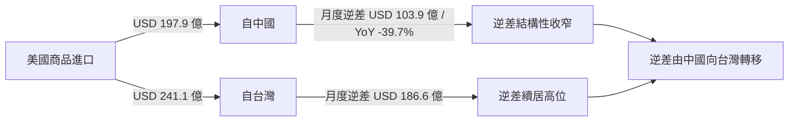

# 財經媒體簡報 — 2026 年第 25 週
{: .key-answer data-question="2026年第25週全球貿易有哪些可引用的重要新聞？"}

> 報告期間：2026-06-09 — 2026-06-15
> 產出時間：2026-06-17
> 自動化程度：80%（數據彙整自動生成，新聞角度建議人工審核）

<div class="article-summary speakable-content" markdown="1">

本週三大可引用焦點：**（1）** 中國商務部公告 2026 年第 20 號將 <span class="data-highlight">7 家歐盟國防／航太實體</span>（FN Herstal、HENSOLDT AG、OMNIPOL 等）列入出口管制管控名單（2026-04-24 生效），出口管制戰線由美、日、台延伸至歐盟；**（2）** US Census 2026 年 4 月數據顯示美中商品貿易逆差收窄至 <span class="data-highlight">USD 103.9 億</span>（YoY −39.7%），同時美國自台灣進口已超越自中國進口；**（3）** 美方執法呈現「天價罰款」態勢，應用材料（Applied Materials）遭 BIS 開出 <span class="data-highlight">USD 2.52 億</span> 頂格罰款。

</div>

<div class="key-takeaway" markdown="1">

**本週重點（可引用）**

- **政策面**：中國出口管制本期出現「歐盟方向」新焦點——7 家歐盟涉軍實體遭列管（4/24 生效，**待人工確認**），同期對 2 家歐盟金融機構取消反制，呈「軍工從嚴、金融緩和」雙軌。
- **數據面**：美中逆差 USD 103.9 億（YoY −39.7%）延續結構性收窄；美自台進口 USD 241.1 億超越自中國的 USD 197.9 億。
- **集中度**：台灣出口 HHI 2522（六國唯一高集中度），韓國 HHI 約 355 最分散、2024 經常帳躍升至約 USD 1,000 億（YoY +207%）。

</div>

> **數據時點說明**：UN Comtrade 雙邊貿易為 **2023-2024 年度**累計；US Census 為 **2026 年 4 月**月度數據；中國出口管制與美方執法為商務部官網最新公告彙整。三者時間口徑不同，請勿直接跨來源加總（資料皆於 2026-06-17 擷取）。

## 本週頭條數據

{: .highlight }
> 以下數據可直接引用，每項皆附來源標註。

### 1. 中國管制 7 家歐盟國防／航太實體，管制戰線首度延伸至歐盟

{: .key-answer data-question="中國對歐盟國防實體的出口管制有何最新進展？"}

**一句話摘要**：
> 中國商務部公告 2026 年第 20 號將 FN Herstal、HENSOLDT AG 等 7 家歐盟國防／航太實體列入出口管制管控名單（2026-04-24 生效），禁止對其出口兩用物項，標誌中國出口管制戰線由美、日、台延伸至歐盟。

**核心數據**：
- 列管實體數：<span class="data-highlight">7 家</span>歐盟涉軍／航太／光電企業（來源：cn_export_control / controlled_item_change，公告 2026 年第 20 號，生效 2026-04-24；交叉引用 policy_tracker 2026-06）
- 名單明細：FN Herstal（比利時）、OMNIPOL a.s.（捷克）、HENSOLDT AG（德國）、EXCALIBUR ARMY（捷克）、SPACEKNOW INC. 捷克分公司、VZLU AEROSPACE（捷克）、FN Browning（比利時）（來源：cn_export_control / controlled_item_change）
- 觸發理由：涉台軍售或與台勾連（來源：發言人答記者問，2026-04-24）
- 同期緩和訊號：商務部令 2026 年第 1 號取消對 2 家歐盟金融機構（UAB Urbo Bankas、AB Mano Bankas）反制（2026-04-24 生效）（來源：cn_export_control / regulation_update）

**可用角度**：
1. **「戰線擴大」角度** — 從美、日、台到歐盟，中國出口管制名單首度結構化納入歐盟國防業者，為中歐關係新變數。
2. **「軍工從嚴、金融緩和」雙軌角度** — 同日列管涉軍實體、取消金融機構反制，凸顯中方措施高度針對性。
3. **「歐洲國防供應鏈曝險」角度** — HENSOLDT（感測光電）、FN Herstal/Browning（輕武器）、VZLU AEROSPACE（航太）若依賴中國原產兩用物項，恐面臨採購摩擦（推測，建議查證）。

**歷史對比**：
- 本系統 W13 媒體簡報（2026-03-23）頭條為「中日出口管制滿月 40 家實體無鬆動」；本期焦點由「對日」轉向「對歐」，反映管制對象地理範圍擴大（來源：media_briefing 2026-W13）。

---

### 2. 美中逆差 USD 103.9 億 YoY 收窄 39.7%，美自台進口超越中國

{: .key-answer data-question="2026年4月美中與美台貿易逆差出現什麼結構性變化？"}

**一句話摘要**：
> US Census 2026 年 4 月數據顯示，美中商品貿易逆差收窄至 USD 103.9 億（YoY −39.7%），同月美國自台灣進口（USD 241.1 億）已超越自中國進口（USD 197.9 億），貿易逆差結構由中國持續向台灣轉移。

**核心數據**：
- 美中 4 月逆差：<span class="data-highlight">USD 103.9 億</span>（−10,394 百萬 USD），相較 2025 年 4 月的 USD 172.4 億，YoY 收窄約 39.7%（來源：us_trade_census / trade_balance，5700，2025-2026）
- 美台 4 月逆差：<span class="data-highlight">USD 186.6 億</span>（−18,657 百萬 USD）（來源：us_trade_census / trade_balance，5830）
- 美自台進口：USD 241.1 億 > 美自中國進口 USD 197.9 億（來源：us_trade_census / monthly_import，2026 年 4 月）
- 美中逆差低檔延續：2026 年 1-4 月介於 −97.6 億至 −127.3 億（來源：us_trade_census / trade_balance，5700）

**可用角度**：
1. **「逆差大搬家」角度** — 逆差從中國轉移至台灣，半導體採購集中驅動，美國對台依賴升高。
2. **「脫鉤深化」角度** — 美自中進口 2026 Q1 約 608.7 億美元、年減 40.9%（來源：investment_insight 2026-Q2），對中採購結構性萎縮。
3. **「近岸／友岸受益」角度** — 對中採購萎縮下，墨西哥、越南等近岸來源受益（推測，建議查證）。

**歷史對比**：
- W13 簡報曾報導 2026 年 1 月美中逆差 YoY −60%、美台逆差 YoY +118%；本期美中逆差續處低檔、美自台進口超越中國，趨勢一致並進一步明朗（來源：media_briefing 2026-W13）。

---

### 3. 美方執法天價罰款：應用材料 USD 2.52 億、GE Aerospace ITAR USD 3,600 萬

{: .key-answer data-question="近期美方對出口管制違規開出了哪些重大罰款？"}

**一句話摘要**：
> 美方出口管制執法明顯升級——應用材料（Applied Materials）因離子注入機經南韓轉運中國未領許可遭 BIS 開出 USD 2.52 億頂格罰款；GE Aerospace 則就 116 項違反 ITAR 達成 USD 3,600 萬和解。

**核心數據**：
- 應用材料罰款：<span class="data-highlight">USD 2.52 億</span>，為涉案貨值（約 USD 1.26 億）兩倍，據報為 BIS 史上第二高罰款（來源：cn_export_control / enforcement_action，2026-02-13；交叉引用 policy_tracker 2026-06）
- 轉運路徑：離子注入機先運往南韓 AMK 組裝、再轉運中國（來源：cn_export_control / enforcement_action）
- GE Aerospace 和解：<span class="data-highlight">USD 3,600 萬</span>、36 個月，涉 116 項違反 AECA／ITAR（含對中未授權出口受控技術資料）（來源：cn_export_control / enforcement_action，2026-04-18）

**可用角度**：
1. **「第三國轉運執法」角度** — 應用材料案凸顯美方對「經韓轉運中國」路徑的執法強化，半導體設備供應鏈須加嚴轉運盡職調查。
2. **「ITAR 合規成本上升」角度** — GE Aerospace 116 項違規和解，航太技術資料跨境傳輸合規負擔增加。
3. **「中方列管、美方重罰」對照角度** — 同期中方以管控名單列管、美方以天價罰款執法，雙向脫鉤壓力具體化。

**歷史對比**：
- 本系統 trade_compliance_digest（2026-W24-W25）將應用材料 2.52 億與 GE 航太 3,600 萬列為本期 ITAR／BIS 執法警示重點，合規篩查需求升高（來源：trade_compliance_digest 2026-W24-W25）。

## 可引用圖表

### 圖表 1：美國對中／台貿易逆差結構轉移（2026 年 4 月）



> 圖表說明：2026 年 4 月美國自台灣進口已超越自中國，美中逆差收窄而美台逆差維持高位，逆差結構持續向台灣轉移。
> 數據來源：us_trade_census / monthly_import、trade_balance（2026 年 4 月）。

### 表格 1：六大經濟體出口市場集中度（HHI，2023-2024）

| 國家 | HHI 指數 | 集中度 | 前 3 大夥伴佔比 |
|------|---------|--------|----------------|
| 台灣 (158) | 2522 | 高（六國唯一） | 約 61.8% |
| 德國 (276) | 1068 | 低 | 約 48.5% |
| 日本 (392) | 801 | 低 | 約 41.7% |
| 中國 (156) | 795 | 低（高度分散） | 約 36.6% |
| 美國 (842) | 584 | 低（最分散群） | 約 31.2% |
| 韓國 (410) | 355 | 低（最分散） | 約 23.4% |

> 數據來源：bilateral_trade_flows / market_concentration（UN Comtrade 2023-2024）。台灣為唯一達高集中度（>2500）者，韓國最分散。

### 表格 2：美國對五大夥伴月度逆差（2026 年 4 月）

| 夥伴 | 進口額 (百萬 USD) | 月度逆差 (百萬 USD) | YoY 逆差變化 |
|------|------------------|---------------------|--------------|
| 中國 (5700) | 19,789.2 | −10,394.1 | 約 −39.7%（vs 2025-04 −17,241.8） |
| 台灣 (5830) | 24,105.8 | −18,657.1 | N/A（去年同月口徑未列） |
| 德國 (4280) | 13,857.4 | −5,748.0 | N/A |
| 韓國 (5800) | 13,564.0 | −5,432.3 | N/A |
| 日本 (5880) | 12,939.9 | −3,977.9 | 約 −41.4%（vs 2025-04 −6,787.9） |

> 數據來源：us_trade_census / monthly_import、trade_balance（2026 年 4 月）。逆差以負值表示；YoY 僅在來源同時提供 2025 年同月時計算，其餘標 N/A 以避免跨口徑誤導。

## 本週政策速覽

{: .comparison-table }

| 政策 | 日期 | 一句話摘要 | 新聞價值 |
|------|------|-----------|---------|
| 公告 2026 年第 20 號：7 家歐盟實體列管 ⚠️待確認 | 生效 2026-04-24 | FN Herstal、HENSOLDT 等 7 家歐盟涉軍實體禁出口兩用物項 | 高 |
| 公告 2026 年第 1 號：對日兩用物項全面禁令 ⚠️待確認 | 生效 2026-01-06 | 禁止對日軍事用戶／用途出口，具域外效力 | 高 |
| 應用材料遭 BIS 罰 USD 2.52 億 | 2026-02-13 | 離子注入機經韓轉運中國未領許可，貨值兩倍頂格罰款 | 高 |
| GE Aerospace ITAR USD 3,600 萬和解 | 2026-04-18 | 116 項違反 AECA／ITAR，含對中未授權技術資料出口 | 中 |
| 稀土通用許可批准 | 2025-12-19 | 合格出口商由逐案許可轉向通用許可，緩解下游瓶頸 | 中 |

> 政策摘要來源：cn_export_control（controlled_item_change / enforcement_action / policy_guidance）；交叉引用 policy_tracker 2026-06、trade_compliance_digest 2026-W24-W25。標 ⚠️待確認者於來源萃取階段標記為 [REVIEW_NEEDED]，引用前務必人工查證。

## 下週觀察

> *以下為推測性內容，僅供新聞選題參考，建議另行查證。*

1. **歐盟方向列管是否擴大** — 第 20 號列管 7 家歐盟實體後，是否因歐盟第 20 輪對俄制裁列單中企而出現對歐進一步反制（預期：未來數月；可能影響：中歐國防／航太供應鏈）。
2. **美中逆差低檔是否延續** — 2026 年 1-4 月美中逆差穩定於百億美元上下，5 月後是否維持結構性收窄（預期：下月 US Census 數據；可能影響：脫鉤敘事與近岸採購）。
3. **韓華海洋反制暫停到期（約 2026-11）** — 一年期暫停是否續展，取決於美方 301 措施動向（預期：2026 年第四季；可能影響：中美海事／造船關係）。
4. **技術目錄第 28 號附件項目級明細** — 待人工調閱確認受影響技術領域（預期：人工查證後；可能影響：技術出口與 JV）。

## 引用指南

### 建議引用格式

```
根據全球貿易情報分析系統數據，2026 年 4 月美中商品貿易逆差收窄至 USD 103.9 億（年減約 39.7%），
同月美國自台灣進口已超越自中國進口。
（資料來源：U.S. Census Bureau，經全球貿易情報分析系統整理）
```

### 原始資料來源

| 數據類型 | 原始來源 | 連結 |
|---------|---------|------|
| 雙邊貿易 / HHI | UN Comtrade | https://comtradeplus.un.org/ |
| 美國月度貿易 / 逆差 | US Census Bureau | https://www.census.gov/foreign-trade/ |
| 宏觀指標（經常帳） | World Bank | https://data.worldbank.org/ |
| 出口管制 / 執法 | 中國商務部 | http://exportcontrol.mofcom.gov.cn/ |

---

## 免責聲明

本報告由自動化系統產出，數據來自多個公開資料源。

**重要聲明**：
- 本報告供新聞參考使用，引用時請標註資料來源。
- 數據可能因來源更新而發生回溯修正。
- 新聞角度建議為系統生成，僅供參考。
- 政策解讀為系統推測，建議另行查證。
- 本期 3 項政策（公告 2026 年第 20 號、第 1 號、技術目錄 2025 年第 28 號）於來源萃取階段標記為 [REVIEW_NEEDED]，相關實體列管與技術目錄解讀建議人工複核。
- 本系統不對引用本報告造成的任何後果負責。

## 已知限制

- **歷史參考**：本系統 media_briefing 最近期報告為 2026-W13（2026-03-23），與本期間隔逾 11 週，前 4 週連續報告不存在，短期趨勢以當期 Extractor 與同期其他 Mode 報告為準。
- **去年同期**：2025-W25 報告不存在，無報告層級 YoY 對照；US Census 之 YoY 僅在來源同時提供 2025 年同月時計算。
- **Qdrant 語意搜尋**：本期以 docs 直接讀取與同期 Mode 報告交叉引用為主，未納入語意檢索結果。
- **口徑差異**：UN Comtrade 為 2023-2024 年度累計、US Census 為 2026 年 4 月月度，不可直接比較或加總。

## 資料來源

- UN Comtrade Database (https://comtradeplus.un.org/)
- U.S. Census Bureau Foreign Trade (https://www.census.gov/foreign-trade/)
- World Bank Open Data (https://data.worldbank.org/)
- 中國商務部出口管制資訊網 (http://exportcontrol.mofcom.gov.cn/)
</content>
</invoke>
