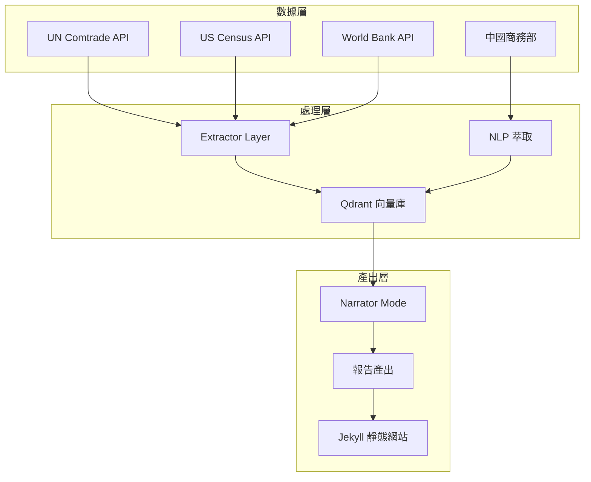

# 關於本站
{: .fs-9 }

全球貿易與供需智慧分析系統
{: .fs-6 .fw-300 }

---

## 系統簡介

**全球貿易情報分析系統**是一個 AI 驅動的自動化貿易情報平台，專注追蹤六大經濟體（台灣、美國、中國、日本、韓國、德國）的貿易動態與出口管制政策。

### 我們提供什麼

| 報告類型 | 頻率 | 目標受眾 |
|----------|------|---------|
| 貿易動態週報 | 每週 | 貿易數據分析師 |
| 供應鏈月報 | 每月 | 供應鏈管理者 |
| 出口管制政策追蹤 | 每月 | 政策研究者、法務 |
| 投資視角貿易分析 | 每季 | 投資分析師 |
| 貿易合規摘要 | 雙週 | 跨境貿易業者 |
| 財經媒體簡報 | 每週 | 財經記者、自媒體 |

---

## 技術架構

### AI 角色

本系統由 **Claude** 驅動，執行以下任務：

1. **NLP 萃取**：分析中國商務部政策文件，萃取關鍵政策訊息、管制物項、生效日期
2. **報告產出**：整合多數據源，依據各 Mode 框架產出結構化報告
3. **語意搜尋**：支援跨期報告的語意關聯查詢

### 數據流程



### 技術棧

| 組件 | 技術 | 用途 |
|------|------|------|
| AI 引擎 | Claude (Anthropic) | NLP 萃取、報告產出 |
| 向量資料庫 | Qdrant | 語意搜尋、歷史比對 |
| 靜態網站 | Jekyll + Just the Docs | 報告展示 |
| 部署 | GitHub Pages | 免費託管 |
| CI/CD | GitHub Actions | 自動化發布 |

---

## 數據來源

所有數據均來自公開、權威的數據源：

| 數據源 | 提供者 | 數據類型 |
|--------|--------|---------|
| [UN Comtrade](https://comtradeplus.un.org/) | 聯合國 | 雙邊貿易流量（年度/季度）|
| [US Census Bureau](https://www.census.gov/foreign-trade/) | 美國商務部 | 美國進出口（月度/商品級別）|
| [World Bank](https://data.worldbank.org/) | 世界銀行 | 宏觀經濟指標（GDP、通膨等）|
| [中國商務部](http://exportcontrol.mofcom.gov.cn/) | 中國政府 | 出口管制政策公告 |

{: .highlight }
> **100% 數據可追溯**：每項數據都標註原始來源，您可自行驗證。

---

## 開源理念

本專案完全開源，原始碼公開於 GitHub：

**[github.com/weiqi-kids/agent.cross-border-trade](https://github.com/weiqi-kids/agent.cross-border-trade)**

### 為什麼開源？

1. **透明可審核**：方法論、計算邏輯完全公開，歡迎專業人士審核
2. **可複製性**：其他研究者可基於本架構建立類似系統
3. **社群貢獻**：歡迎提交 Issue 或 Pull Request 改善系統

### 授權條款

- **報告內容**：採用 [CC BY 4.0](https://creativecommons.org/licenses/by/4.0/) 授權，可自由引用，需標註來源
- **程式碼**：採用 MIT 授權

---

## 引用建議

引用本站報告時，建議採用以下格式：

```
根據全球貿易情報分析系統數據，[數據內容]。
（資料來源：全球貿易情報分析系統，原始數據來自 [UN Comtrade/US Census/...]）
```

### 學術引用格式

```
全球貿易情報分析系統 (2026)。[報告標題]。
取自 https://trade.weiqi.kids/[報告路徑]
```

---

## 聯絡方式

- **技術問題**：請在 [GitHub Issues](https://github.com/weiqi-kids/agent.cross-border-trade/issues) 提交
- **資料回饋**：歡迎指出數據錯誤或建議改善

---

## 免責聲明

1. 本站報告僅供參考，不構成投資、法律或商業建議
2. 數據來自公開來源，可能存在時滯或誤差
3. 趨勢解讀為 AI 分析結果，建議搭配專業判斷使用
4. 使用本站數據進行決策，風險由使用者自行承擔

---

<p style="text-align: center; color: #666; font-size: 0.85em;">
<em>Powered by Claude Code</em> |
<a href="https://github.com/weiqi-kids/agent.cross-border-trade">GitHub</a> |
<a href="/">返回首頁</a>
</p>
