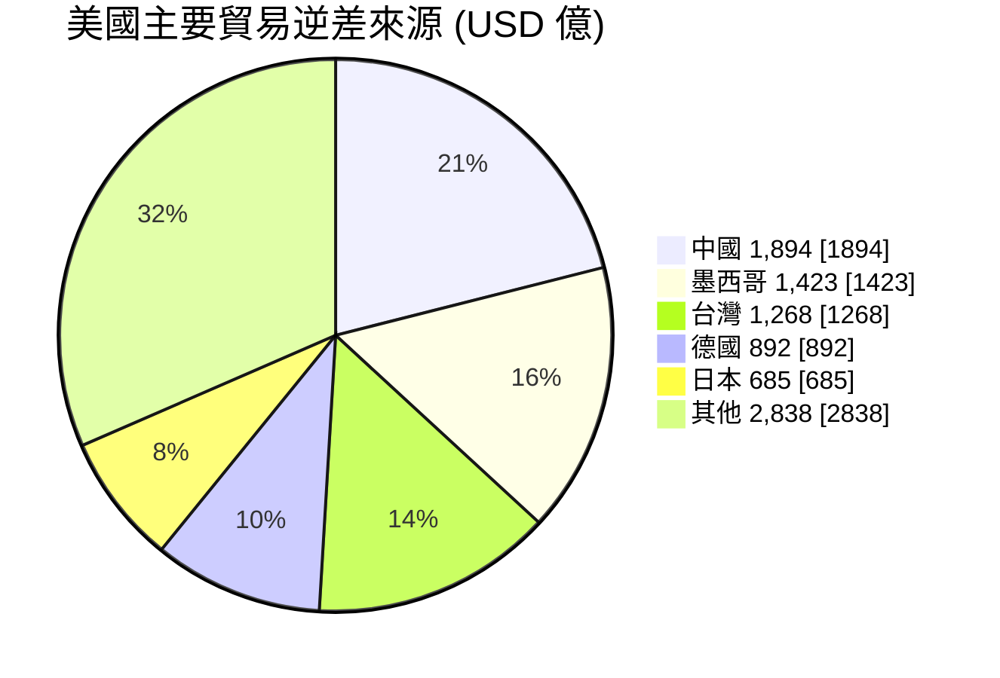

# 全球貿易情報分析
{: .fs-9 }

Global Trade Intelligence System
{: .fs-6 .fw-300 }

> 最後更新：{{ site.time | date: "%Y-%m-%d" }} | 資料期間：2026 第 08 週

---

## 找到適合你的報告

{: .note-title }
> 快速導航
>
> 選擇你的角色，找到最適合的分析報告。

| 角色 | 適合報告 | 頻率 | 重點內容 |
|:-----|:---------|:----:|:---------|
| 📈 **貿易數據分析師** | [貿易動態週報](/trade-briefing/) | 每週 | 進出口數據、市場變化 |
| 🔗 **供應鏈管理者** | [供應鏈月報](/supply-chain-analysis/) | 每月 | 集中度風險、多元化策略 |
| 📜 **政策研究者** | [出口管制政策追蹤](/policy-tracker/) | 每月 | 政策演進、深度分析 |
| 📊 **投資分析師** | [投資視角貿易分析](/investment-insight/) | 每季 | 產業趨勢、投資機會 |
| 🚢 **跨境貿易業者** | [貿易合規摘要](/trade-compliance-digest/) | 雙週 | 合規指引、行動清單 |
| 📰 **財經媒體** | [財經媒體簡報](/media-briefing/) | 每週 | 可引用數據、新聞角度 |

---

## 本週重點

| 信號 | 重點 | 說明 | 來源 |
|:----:|------|------|:----:|
| 🔺 | **美台逆差激增** | 2025 全年 USD 1,269 億，較 2024 年 +72% | [W08]() |
| ⚠️ | **中日出口管制持續執行** | 禁止雙用物項出口至日本軍事用戶（已執行約 6 週） | [W08]() |
| 🔻 | **美中逆差收窄** | 2025 全年 USD 1,894 億，較 2024 年收窄 36% | [W08]() |
| 🔄 | **安世半導體爭議** | 中荷磋商進展有限，荷方立場強硬 | [W08]() |

---

## 風險信號

### 市場集中度 (HHI 指數)

| 經濟體 | HHI | 等級 | 前三大市場占比 | 趨勢 |
|:------:|----:|:----:|---------------:|:----:|
| 台灣 | 1,183 | ⚠️ 接近中度 | 54.08% | → |
| 德國 | 1,189 | ⚠️ 接近中度 | 53.37% | → |
| 南韓 | 911 | ✅ 低 | 46.70% | → |
| 日本 | 895 | ✅ 低 | 44.26% | → |
| 美國 | 724 | ✅ 低 | 40.41% | → |
| 中國 | 447 | ✅ 最分散 | 27.34% | → |

{: .note }
> HHI < 1,500 為低集中度，1,500-2,500 為中度，> 2,500 為高度。台灣與德國接近中度門檻，需關注市場多元化。

### 政策動態統計

| 類別 | 2026 年新增 | 追蹤中 |
|------|------------:|-------:|
| 法規更新 (regulation_update) | 3 | 15 |
| 執法行動 (enforcement_action) | 2 | 8 |
| 管制清單變更 (controlled_item_change) | 1 | 5 |

---

## 美國貿易逆差結構 (2025 全年)

---

## 最新報告

### 貿易動態週報

| 期別 | 日期範圍 | 重點 | 連結 |
|------|----------|------|:----:|
| W08 | 02-17 ~ 02-23 | 美台逆差 +72%、美中逆差收窄 36%、安世爭議 | [查看]() |
| W07 | 02-10 ~ 02-16 | 美台逆差 +72%、中日出口管制 | [查看]() |
| W06 | 02-03 ~ 02-09 | 重稀土管制生效、FDPR 暫停延長 | [查看]() |
| W05 | 01-27 ~ 02-02 | 鋰電池材料出口管制實施 | [查看]() |

### 供應鏈月報

| 期別 | 重點 | 連結 |
|------|------|:----:|
| 2026-02 | 稀土管制域外效力、中日雙用物項禁令 | [查看]() |
| 2026-01 | 戰略材料管制體系全面運作 | [查看]() |

### 出口管制政策追蹤

| 期別 | 重點 | 連結 |
|------|------|:----:|
| *即將推出* | 首份報告將於下次完整流程執行時產出 | [前往](/policy-tracker/) |

### 投資視角貿易分析

| 期別 | 重點 | 連結 |
|------|------|:----:|
| *即將推出* | 首份報告將於下次完整流程執行時產出 | [前往](/investment-insight/) |

### 貿易合規摘要

| 期別 | 重點 | 連結 |
|------|------|:----:|
| *即將推出* | 首份報告將於下次完整流程執行時產出 | [前往](/trade-compliance-digest/) |

### 財經媒體簡報

| 期別 | 頭條數據 | 連結 |
|------|----------|:----:|
| *即將推出* | 首份報告將於下次完整流程執行時產出 | [前往](/media-briefing/) |

---

## 覆蓋範圍

**目標經濟體**：台灣、美國、中國、日本、韓國、德國

**資料來源**：
- [UN Comtrade](https://comtradeplus.un.org/) — 雙邊貿易流量
- [US Census Bureau](https://www.census.gov/foreign-trade/) — 美國月度貿易
- [World Bank](https://data.worldbank.org/) — 宏觀經濟指標
- [中國商務部出口管制網](http://exportcontrol.mofcom.gov.cn/) — 出口管制政策

---

<em>Powered by Claude Code</em> |
<a href="https://github.com/weiqi-kids/agent.cross-border-trade">GitHub</a>

