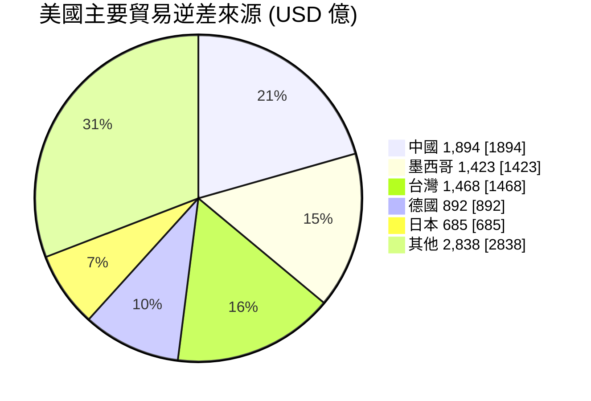

last_modified_at: 2026-06-17

# 全球貿易情報分析
{: .fs-9 }

Global Trade Intelligence System
{: .fs-6 .fw-300 }

> 最後更新：{{ site.time | date: "%Y-%m-%d" }} | 資料期間：2026 第 25 週

<details>
<summary><strong>📖 符號說明</strong></summary>

| 符號 | 含義 |
|:----:|------|
| 🔺 | 上升/增加趨勢 |
| 🔻 | 下降/減少趨勢 |
| ⚠️ | 需關注/接近風險閾值 |
| 🔄 | 持續追蹤中的議題 |
| ✅ | 正常/低風險 |
| → | 趨勢持平 |

</details>

---

## 找到適合你的報告

{: .note-title }
> 快速導航
>
> 選擇你的角色，找到最適合的分析報告。

| 角色 | 適合報告 | 頻率 | 重點內容 |
|:-----|:---------|:----:|:---------|
| 📈 **貿易數據分析師** | [貿易動態週報]() | 每週 | 進出口數據、市場變化 |
| 🔗 **供應鏈管理者** | [供應鏈月報]() | 每月 | 集中度風險、多元化策略 |
| 📜 **政策研究者** | [出口管制政策追蹤]() | 每月 | 政策演進、深度分析 |
| 📊 **投資分析師** | [投資視角貿易分析]() | 每季 | 產業趨勢、投資機會 |
| 🚢 **跨境貿易業者** | [貿易合規摘要]() | 雙週 | 合規指引、行動清單 |
| 📰 **財經媒體** | [財經媒體簡報]() | 每週 | 可引用數據、新聞角度 |

---

## 為什麼選擇我們

{: .important-title }
> 四大差異化優勢
>
> 與其他貿易數據平台相比，我們提供獨特價值。

| 優勢 | 說明 |
|:-----|:-----|
| **🌐 雙語政策追蹤** | 同時追蹤中國商務部（中文）與國際數據源（英文），提供跨語言政策洞察 |
| **🔍 100% 數據可追溯** | 每項數據標註原始來源（UN Comtrade、US Census、World Bank），可自行驗證 |
| **⚡ 極速載入** | PageSpeed 效能 88/100，比主要競品快 5-9 倍（OEC 38 分、OWID 31 分）|
| **🔓 開源透明** | 完整原始碼公開於 [GitHub](https://github.com/weiqi-kids/agent.cross-border-trade)，方法論可審核 |

---

## 本週重點

| 信號 | 重點 | 說明 | 來源 |
|:----:|------|------|:----:|
| 🆕 | **中國管制 7 家歐盟國防／航太實體** | 商務部公告 2026 第 20 號（2026-04-24 生效）：FN Herstal、HENSOLDT AG 等，出口管制戰線首度延伸至歐盟 | [W25]() |
| 🔻 | **美中 4 月逆差 USD 103.9 億** | YoY −39.7%，2026 年 1-4 月結構性收窄，中美貿易流向持續轉移 | [W25]() |
| 🔺 | **美自台進口超越中國** | 美自台灣進口 USD 241.1 億 > 自中國 USD 197.9 億；美台逆差 USD 186.6 億 | [W25]() |
| 🔄 | **政策雙軌：對歐從嚴、對部分對象緩和** | 取消對 2 家歐盟銀行反制、暫停韓華海洋反制一年；對日兩用物項全面禁令持續 | [2026-06]() |

{: .fs-2 .text-grey-dk-000 }
> 📊 數據來源：[US Census Bureau](https://www.census.gov/foreign-trade/) 貿易統計、[中國商務部](http://exportcontrol.mofcom.gov.cn/) 出口管制政策

---

## 風險信號

### 市場集中度 (HHI 指數)

| 經濟體 | HHI | 等級 | 前三大市場占比 | 趨勢 |
|:------:|----:|:----:|---------------:|:----:|
| 台灣 | 2,522.42 | ❗ 高集中 | 61.83% | → |
| 德國 | 1,068.15 | ⚠️ 接近中度 | 48.47% | → |
| 日本 | 801.25 | ✅ 低 | 41.68% | → |
| 中國 | 795.17 | ✅ 低 | 36.58% | → |
| 美國 | 583.76 | ✅ 低 | 31.20% | → |
| 南韓 | 354.65 | ✅ 最分散 | 23.43% | → |

{: .note }
> HHI < 1,500 為低集中度，1,500-2,500 為中度，> 2,500 為高度。台灣 HHI 2522.42 為六大經濟體最高，已突破高集中度門檻，對美出口近半，市場多元化風險顯著上升。

{: .fs-2 .text-grey-dk-000 }
> 📊 數據來源：[UN Comtrade](https://comtradeplus.un.org/) 2024 年度出口數據計算

### 政策動態統計

| 類別 | 2026 年新增 | 追蹤中 |
|------|------------:|-------:|
| 法規更新 (regulation_update) | 3 | 99 |
| 執法行動 (enforcement_action) | 4 | 12 |
| 管制清單變更 (controlled_item_change) | 3 | 13 |
| 政策指導 (policy_guidance) | 2 | 5 |
| 國際合作 (international_cooperation) | 6 | 19 |

{: .fs-2 .text-grey-dk-000 }
> 📊 數據來源：[中國商務部出口管制資訊網](http://exportcontrol.mofcom.gov.cn/) 統計至 2026-06-17

---

## 美國貿易逆差結構 (2025 全年)


```mermaid
pie showData
    title 美國主要貿易逆差來源 (USD 億)
    "中國 1,894" : 1894
    "墨西哥 1,423" : 1423
    "台灣 1,468" : 1468
    "德國 892" : 892
    "日本 685" : 685
    "其他 2,838" : 2838
```

{: .fs-2 .text-grey-dk-000 }
> 📊 數據來源：[US Census Bureau](https://www.census.gov/foreign-trade/) 2025 年 1-12 月累計貿易統計

---

## 最新報告

### 貿易動態週報

| 期別 | 日期範圍 | 重點 | 連結 |
|------|----------|------|:----:|
| W25 | 06-15 ~ 06-21 | 中國管制 7 家歐盟實體、美中 4 月逆差 −39.7%、美自台進口超越中國 | [查看]() |
| W13 | 03-23 ~ 03-29 | 中日出口管制滿月無鬆動、美台逆差 +118% 創高、美中逆差 -60% | [查看]() |
| W12 | 03-16 ~ 03-22 | 英國制裁中國企業引發反制警告、台灣 HHI 飆升至 2522 | [查看]() |
| W09 | 02-24 ~ 02-28 | 中國對日40家實體出口管制雙軌制 | [查看]() |
| W08 | 02-17 ~ 02-23 | 美台逆差 +72%、美中逆差收窄 36%、安世爭議 | [查看]() |

### 供應鏈月報

| 期別 | 重點 | 連結 |
|------|------|:----:|
| 2026-06 | 台灣 HHI 2522 六國唯一高集中、對日兩用物項禁令、7 家歐盟實體列管、稀土許可放寬 | [查看]() |
| 2026-03 | 台灣 HHI 飆升至 2522、英國制裁反制風險、美台逆差倍增 | [查看]() |
| 2026-02 | 40家日本實體出口管制雙軌制、稀土管制域外效力 | [查看]() |
| 2026-01 | 戰略材料管制體系全面運作 | [查看]() |

### 出口管制政策追蹤

| 期別 | 重點 | 連結 |
|------|------|:----:|
| 2026-06 | 7 家歐盟實體列管、對日兩用物項全面管制、中美執法對照、稀土通用許可放寬 | [查看]() |
| 2026-03 | 英國涉俄制裁回應、對日40家實體管制持續、戰略材料管制追蹤 | [查看]() |
| 2026-02 | 40家日本實體管制雙軌制、稀土境外管制、中美實體清單緩和 | [查看]() |

### 投資視角貿易分析

| 期別 | 重點 | 連結 |
|------|------|:----:|
| 2026-Q2 | 政策風險成 Q2 主驅動、中日兩用物項斷流、美方天價執法、美中脫鉤加深 | [查看]() |
| 2026-Q1 | 對日40家實體管制、全球貿易分化加劇、關鍵材料管制深化（更新：2026-03-23） | [查看]() |

### 貿易合規摘要

| 期別 | 重點 | 連結 |
|------|------|:----:|
| W24-W25 | 列管實體篩查擴大（7 歐盟/8 台灣/28 美國）、對日兩用物項管制、易制毒前驅化學品、美方執法判例 | [查看]() |
| W13-W14 | 對日40家實體管制滿月追蹤、英國涉俄制裁後續觀察、禁毒委制毒物品通告 | [查看]() |
| W11-W12 | 英國涉俄制裁納入中國企業、對日雙軌制執行滿月、中美暫停措施倒數 | [查看]() |

### 財經媒體簡報

| 期別 | 頭條數據 | 連結 |
|------|----------|:----:|
| W25 | 中國管制 7 家歐盟實體、美自台進口超越中國、美方天價執法對照、台灣 HHI 2522 vs 韓國 355 | [查看]() |
| W13 | 中日出口管制滿月無鬆動、台灣 HHI 2522.42 六國最高、美台逆差 +118% | [查看]() |
| W12 | 英國制裁中國企業引發反制警告、台灣 HHI 飆升至 2522、美台逆差倍增至 1468 億 | [查看]() |

---

## 如何使用本站

{: .highlight }
> **3 步驟快速上手**

1. **找到你的報告** — 從上方「找到適合你的報告」選擇你的角色，點擊對應報告
2. **追蹤關鍵信號** — 「本週重點」區塊顯示最新的重大變化（🔺 上升、🔻 下降、⚠️ 警示）
3. **深入分析** — 點擊報告連結閱讀完整分析，查看數據來源和相關報告

**訂閱更新**：
- 使用 [RSS Feed](/feed.xml) 訂閱最新報告
- 每週一發布貿易動態週報，每月初發布供應鏈月報

**引用建議**：
引用本站數據時，請標註「資料來源：全球貿易情報分析系統，原始數據來自 [UN Comtrade/US Census/...]」

---

## 訂閱更新

{: .note-title }
> 保持追蹤
>
> 訂閱以接收最新報告通知。

| 方式 | 說明 | 連結 |
|------|------|:----:|
| **RSS Feed** | 使用 Feedly、Inoreader 等 RSS 閱讀器訂閱 | [訂閱 RSS](/feed.xml) |
| **GitHub Watch** | 在 GitHub 點擊 Watch 接收更新通知 | [GitHub](https://github.com/weiqi-kids/agent.cross-border-trade) |

{: .fs-2 .text-grey-dk-000 }
> Email 訂閱功能開發中，敬請期待。

---

## 覆蓋範圍

**目標經濟體**：台灣、美國、中國、日本、韓國、德國

**資料來源**：
- [UN Comtrade](https://comtradeplus.un.org/) — 雙邊貿易流量
- [US Census Bureau](https://www.census.gov/foreign-trade/) — 美國月度貿易
- [World Bank](https://data.worldbank.org/) — 宏觀經濟指標
- [中國商務部出口管制網](http://exportcontrol.mofcom.gov.cn/) — 出口管制政策

---

## 方法論

<details>
<summary><strong>HHI 市場集中度計算</strong></summary>

Herfindahl-Hirschman Index (HHI) 用於衡量出口市場集中度：

```
HHI = Σ(市場份額²) × 10,000
```

| HHI 範圍 | 集中度等級 | 風險評估 |
|----------|-----------|---------|
| < 1,500 | 低集中度 | 市場分散，風險較低 |
| 1,500-2,500 | 中度集中 | 需關注主要市場變動 |
| > 2,500 | 高集中度 | 高度依賴，需多元化策略 |

</details>

<details>
<summary><strong>數據處理流程</strong></summary>

1. **數據擷取**：每週自動從 UN Comtrade、US Census、World Bank API 擷取最新數據
2. **NLP 萃取**：使用 Claude 對中國商務部政策文件進行語意分析，萃取關鍵政策訊息
3. **向量儲存**：萃取結果存入 Qdrant 向量資料庫，支援語意搜尋
4. **報告產出**：依據各 Mode 框架，整合數據產出結構化報告
5. **人工審核**：自動化程度標記為 80%，趨勢解讀建議人工審核

</details>

<details>
<summary><strong>數據時效性</strong></summary>

| 數據源 | 更新頻率 | 時滯 |
|--------|---------|------|
| UN Comtrade | 年度/季度 | 約 2 個月 |
| US Census | 月度 | 約 6 週 |
| World Bank | 年度 | 約 6 個月 |
| 中國商務部 | 即時 | 政策公告當日 |

</details>

---

<p style="text-align: center; color: #666; font-size: 0.85em;">
<em>Powered by Claude Code</em> |
<a href="https://github.com/weiqi-kids/agent.cross-border-trade">GitHub</a>
</p>
