# 全球貿易情報分析
{: .fs-9 }

Global Trade Intelligence System
{: .fs-6 .fw-300 }

> 最後更新：{{ site.time | date: "%Y-%m-%d" }} | 資料期間：2026 第 07 週

---

## 本週重點

| 信號 | 重點 | 說明 | 來源 |
|:----:|------|------|:----:|
| 🔺 | **美台逆差激增** | 2025 全年 USD 1,268 億，較 2024 年 +72% | [W07]() |
| ⚠️ | **中日出口管制** | 禁止雙用物項出口至日本軍事用戶（2026-01-06 生效） | [W07]() |
| 🔄 | **安世半導體爭議** | 中荷持續磋商，半導體供應鏈緊張態勢未解 | [W07]() |

---

## 風險信號

### 市場集中度 (HHI 指數)

| 經濟體 | HHI | 等級 | 前三大市場占比 | 趨勢 |
|:------:|----:|:----:|---------------:|:----:|
| 台灣 | 1,183 | ⚠️ 接近中度 | 54.08% | → |
| 德國 | 1,189 | ⚠️ 接近中度 | 53.37% | → |
| 南韓 | 911 | ✅ 低 | 46.70% | → |
| 日本 | 895 | ✅ 低 | 44.26% | → |
| 美國 | 724 | ✅ 低 | 40.41% | → |
| 中國 | 447 | ✅ 最分散 | 27.34% | → |

{: .note }
> HHI < 1,500 為低集中度，1,500-2,500 為中度，> 2,500 為高度。台灣與德國接近中度門檻，需關注市場多元化。

### 政策動態統計

| 類別 | 2026 年新增 | 追蹤中 |
|------|------------:|-------:|
| 法規更新 (regulation_update) | 3 | 15 |
| 執法行動 (enforcement_action) | 2 | 8 |
| 管制清單變更 (controlled_item_change) | 1 | 5 |

---

## 美國貿易逆差結構 (2025 全年)

```mermaid
pie showData
    title 美國主要貿易逆差來源 (USD 億)
    "中國 1,894" : 1894
    "墨西哥 1,423" : 1423
    "台灣 1,268" : 1268
    "德國 892" : 892
    "日本 685" : 685
    "其他 2,838" : 2838
```

---

## 最新報告

### 貿易動態週報

| 期別 | 日期範圍 | 重點 | 連結 |
|------|----------|------|:----:|
| W07 | 02-10 ~ 02-16 | 美台逆差 +72%、中日出口管制 | [查看]() |
| W06 | 02-03 ~ 02-09 | 重稀土管制生效、FDPR 暫停延長 | [查看]() |
| W05 | 01-27 ~ 02-02 | 鋰電池材料出口管制實施 | [查看]() |

### 供應鏈月報

| 期別 | 重點 | 連結 |
|------|------|:----:|
| 2026-02 | 稀土管制域外效力、中日雙用物項禁令 | [查看]() |
| 2026-01 | 戰略材料管制體系全面運作 | [查看]() |

---

## 覆蓋範圍

**目標經濟體**：台灣、美國、中國、日本、韓國、德國

**資料來源**：
- [UN Comtrade](https://comtradeplus.un.org/) — 雙邊貿易流量
- [US Census Bureau](https://www.census.gov/foreign-trade/) — 美國月度貿易
- [World Bank](https://data.worldbank.org/) — 宏觀經濟指標
- [中國商務部出口管制網](http://exportcontrol.mofcom.gov.cn/) — 出口管制政策

---

<em>Powered by Claude Code</em> |
<a href="https://github.com/weiqi-kids/agent.cross-border-trade">GitHub</a>

